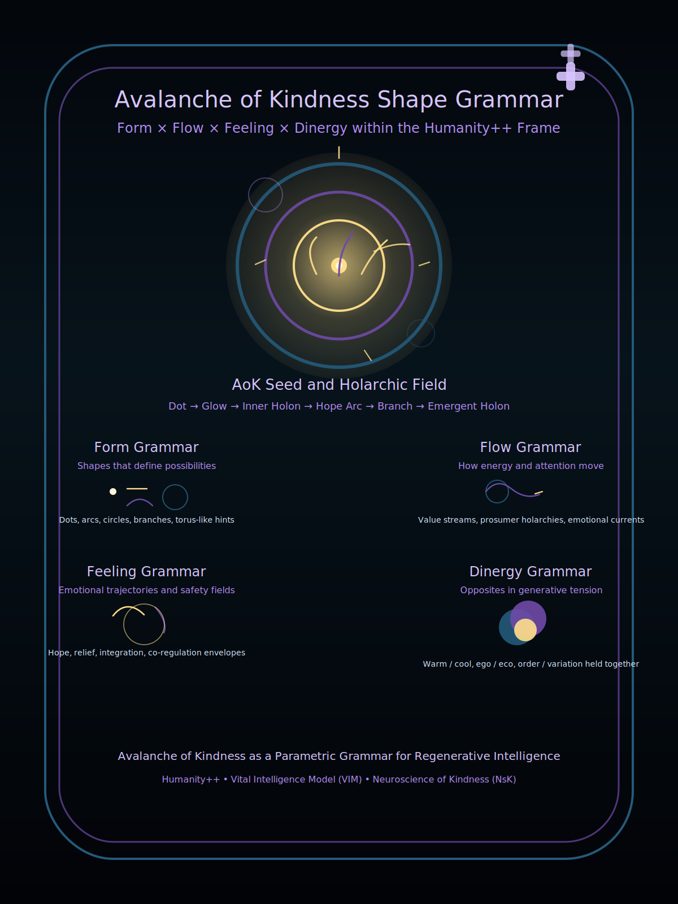

# AoK Sketchbook: Shape Grammar

## **Avalanche of Kindness (AoK) Shape Grammar**

#### _A Generative Framework for Compassionate Systems Leadership in Times of Transition_

***

### **Introduction: A New Literacy for a World in Transition**

Humanity is living through a phase-shift—an era where complexity, uncertainty, and accelerating technological power are reshaping every dimension of life. Our institutions, infrastructures, and social contracts were built for a different world, and the mismatch between old models and emerging realities is producing global turbulence.

But beneath the instability is an equally powerful opportunity:\
a chance to cultivate a **new way of seeing**, a new grammar for understanding how human systems can shift from fragmentation toward coherence, from extraction toward regeneration, and from fear toward compassion.

The _Avalanche of Kindness_ (AoK) Shape Grammar is a generative framework designed to support this transition. Inspired by the spirit of Paul Klee’s _Pedagogical Sketchbook_, the grammar uses **simple visual forms**—dots, arcs, circles, branches, gradients—to reveal **deep principles** of emotional intelligence, relational leadership, and complex adaptive systems.

Just as Klee taught students to perceive the underlying forces shaping movement and form, the AoK grammar helps leaders and learners perceive the energetic and emotional forces shaping human systems:\
how conflict becomes tension, how tension becomes possibility, and how small acts of care can cascade into transformative change.

This online sketchbook serves as a living guide for anyone working at the intersection of compassion, complexity science, and the future of human-AI collaboration. It is a tool for grounding relationships during the uncertainty of phase change transitions—an invitation to cultivate generative leadership capable of holding nuance, pacing transformation, and nurturing resilient communities.

***

## **What Is the AoK Shape Grammar?**

**The AoK Shape Grammar is a&#x20;**_**visual and narrative language**_ for understanding how individual actions, emotional trajectories, and small relational shifts can propagate across networks to create emergent, systemic change.

It is built on four fundamental components:

#### **1. Form Grammar — The Shapes of Possibility**

The basic shapes—dots, arcs, circles, branches, and toroidal loops—represent the building blocks of relational and cognitive structure.\
They teach us to see how systems hold energy, how they bend, how they connect, and how they grow.

#### **2. Flow Grammar — The Movement of Energy and Attention**

Flows show how trust, emotion, information, and influence move through a network.\
Understanding these currents is essential for leadership, because culture is shaped not by intention but by _the patterns of flow_ that organizations repeatedly enact.

#### **3. Feeling Grammar — The Emotional Architecture of Change**

Hope arcs, relief curves, safety envelopes, and integration loops reveal the emotional thermodynamics beneath decision-making and collaboration.\
Emotional literacy becomes an essential systems skill for navigating change without collapse.

#### **4. Dinergy Grammar — Opposites in Generative Tension**

Warm (gold) and cool (teal) dynamics meet in violet, the color of integration.\
Dinergy teaches us to hold polarity—structure and emergence, ego and ecosystem, clarity and compassion—as creative tension, not conflict.

Together, these grammars form a **holarchic architecture** for understanding how local acts of care can scale into global stability.

***

## **Why This Grammar Matters Now**

Across societies, industries, and technologies, we see systems reaching states of overload:

* emotional exhaustion
* polarized narratives
* collapsing trust
* extractive information ecosystems
* fragile institutions
* rigidified worldviews

Yet these challenges are not signs of failure—they are symptoms of a **system approaching the edge of transformation**.

The AoK grammar helps leaders navigate this moment by offering:

* **a non-threatening model** for discussing change
* **a visual language** that bridges technical and human perspectives
* **a narrative structure** that speaks to both logic and emotion
* **a grounded path** for integrating AI into relational systems
* **a framework for designing regenerative cultures**

In complexity science terms, this is a guide for shifting from brittle, hierarchical attractors toward **distributed, compassionate, adaptive networks**.

***

## **How This Sketchbook Is Organized**

This sketchbook is structured as a **living, evolving pedagogical sketchbook**.\
Many sections begin with a simple shape or gesture, followed by the deeper principle it expresses and how it relates to leadership, culture, and systemic change.

You can navigate the material in any order, but the recommended progression is:

***

### 1. The Dot That Decides to Move

A dot is a pause, a moment of awareness, a point of potential.\
It is the instant where we could repeat the old pattern—or choose something else.

### **2. The Kindness Line: A Gesture That Opens a World**

How small acts become arcs of possibility.\
&#xNAN;_&#x45;quivalent to Klee’s “line walking across the page.”_

### **3. Meeting Resistance: The Birth of Dinergy**

How tension becomes generative rather than destructive.

### **4. Emotional Trajectories: Hope, Relief, and Integration**

Understanding emotional dynamics as systemic forces.

### **5. Circles That Breathe: Holons and Holarchy**

How individuals, teams, and ecosystems interrelate.

### **6. Branching Patterns: Creativity and Collective Intelligence**

How kindness cascades through networks.

### **7. Transparency and Overlapping Fields**

Why healthy systems require permeability and shared resonance.

### **8. Humanity++ as a Vessel for Evolution**

A container for collective growth, stewardship, and regenerative AI collaboration.

### **9. The Full AoK Shape Grammar Poster**

A visual synthesis of the entire model.

### **10. Applications for Leaders, Educators, and Technologists**

How to use the grammar in:

* organizational design
* AI governance
* conflict resolution
* community transformation
* trauma-informed collaboration
* complexity leadership training

### **11. Practices for Grounding During Phase Change**

Breathwork, reflective journaling, aesthetic attention, and contemplative movement.

***

## **An Invitation to Co-Create**

The AoK Shape Grammar is not a static doctrine.\
It is a generative model—an evolving language—shaped by lived experience and emergent insight.

As you explore these ideas, you are invited to:

* adapt the grammar
* sketch your own diagrams
* teach it to others
* use it in your organization
* co-author new patterns
* combine it with local wisdom traditions
* integrate it with AI tools and artistic practices

This AoK Sketchbook marks the beginning of a growing ecosystem dedicated to helping humanity move through this transition with wisdom, dignity, and compassion.

**Welcome to the Avalanche of Kindness.**\
**Let us learn to see—and shape—the world anew.**

### **Poster Illustrating AoK Shape Grammar Primitives**&#x20;

<figure><figcaption></figcaption></figure>

***


