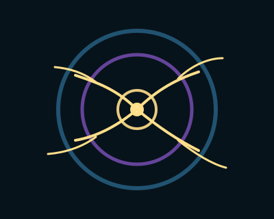

# Branching: Emergent Growth

## **Branching Patterns: Creativity, Differentiation & Collective Intelligence**

#### _Lesson Five of the Avalanche of Kindness Shape Grammar_

Circles give us coherence.\
But life evolves through **branching**.

Every biological system—from trees to lungs to river deltas to neural networks—grows by:

* differentiating,
* extending,
* experimenting,
* exploring,
* fracturing,
* recombining.

When the circle of a holon _breathes_, a new phase begins:

> **The living system expresses itself outward.**\
> This is the moment of branching.

In the Avalanche of Kindness grammar, branching patterns represent:

* creative exploration,
* distributed learning,
* adaptive problem solving,
* evolutionary differentiation,
* the emergence of collective intelligence.

Where circles teach us **how to be**,\
branches teach us **how to become**.

***

## **1. Branching as the Signature of Living Intelligence**

Everywhere life thrives, you find a branching structure:

* trees (nutrient distribution & light seeking)
* mycelial networks (resource flow & communication)
* neurons (signal propagation & pattern formation)
* blood vessels (transport & metabolism)
* coastlines (erosion & resilience)
* family trees (connection & inheritance)
* knowledge graphs (conceptual evolution)
* git repositories (creative divergence)

Branching is:

* **exploratory**—reaching toward possibility,
* **adaptive**—modifying structure based on feedback,
* **distributed**—no single branch controls the whole.

This is a map of complexity itself.

AoK treats branching as a sacred geometry of **creative kindness**:\
the moment when compassion expresses itself into the world in multiple directions.

***

## **2. Differentiation Without Fragmentation**

Many systems fear branching because they associate it with fragmentation:

* people breaking off into silos,
* teams moving in divergent directions,
* ideas proliferating too fast,
* conflict emerging from difference.

But _healthy_ branching is not fragmentation.\
It’s **multi-directional exploration grounded in a coherent core**.

A tree’s branches go in many directions,\
but they share a root system.

AoK teaches:

> **Differentiation strengthens the system when coherence is maintained.**
>
> Differentiation weakens the system when coherence is lost.

The wisdom lies in balancing the two.

Circles → coherence\
Branches → diversity

Holarchy holds them both.

***

## **3. Branching as Emotional and Creative Growth**

Branching also captures emotional dynamics:

* a new direction after healing,
* a breakthrough after resilience,
* a divergence from old constraint,
* a widening of empathy,
* a rediscovery of agency.

In trauma healing, branching often represents:

* reclaiming forgotten capacities,
* exploring new relational patterns,
* expanding one’s identity beyond survival mode.

In creativity, branching is the birth of variation.

In leadership, branching is decentralization.

In AI development, branching is iteration and generative diversity.

***

## **4. Collective Intelligence Emerges Through Branching**

When multiple holons branch simultaneously—but remain connected through shared purpose—a **collective intelligence** emerges.

This is how:

* ecosystems self-stabilize,
* cities evolve,
* organizations innovate,
* open-source communities flourish,
* social movements propagate,
* human cultures diversify.

Collective intelligence is not made of uniform units.\
It is made of **distributed, diverse, relationally-integrated agents**.

The AoK movement uses branching patterns to model how:

* kindness spreads,
* ideas proliferate,
* communities adapt,
* emergence happens ethically.

***

## **Leadership Narrative: Guiding Branching Without Losing Coherence**

Creative branching is the moment when a system comes alive,\
but it is also when it becomes vulnerable.

Leaders who embrace branching patterns must cultivate three capacities:

***

### **Leadership Insight 1: Enable Safe-to-Try Experiments**

Branching thrives when experiments are:

* small,
* reversible,
* generative,
* psychologically safe,
* supported without micromanagement.

The leader becomes a **gardener of possibilities** rather than a controller of outcomes.

***

### **Leadership Insight 2: Maintain Coherence Through Shared Purpose**

Branching becomes chaotic when:

* purpose is unclear,
* communication is low,
* values are not embodied,
* relational trust is weak.

Shared purpose acts like a trunk—\
anchoring many branching efforts in a stable center.

Emergence requires both:

* **many branches**,
* **one living root**.

***

### **Leadership Insight 3: Integrate Agentic AI as Collaborative Branches**

Branching is exactly how **Agentic AI systems** should be integrated:

* multiple agents exploring different tasks,
* learning in parallel,
* sharing insights back to the human center,
* iterating quickly but coherently.

If AI branches without coherence → fragmentation, risk, harm.\
If AI has coherence without branching → rigidity, loss of innovation.\
If AI branches _and_ coheres → **collective intelligence amplification**.

This is the future architecture of human-AI collaboration:\
holarchic, branching, relational, regenerative.

***

## **A Practice for Leaders and Learners**

1. **Identify one coherent circle** in your life or work.\
   A team, a relationship, a project, a personal intention.
2. **Name two or three branches** that want to emerge.\
   New ideas? New skills? New collaborations?
3. Ask:\
   **What root system connects these branches?**
4. Ask:\
   **What would make exploration feel safe enough to begin?**
5. Finally:\
   **Which branch can you nourish today?**

This is how complexity grows gracefully.

***

## **SVG: Branching Patterns from the Holon Core**

This SVG visually expresses:

* a coherent set of circles (holon),
* branching gold lines growing outward,
* slight fractal angles for natural growth,
* violet and teal fields holding the structure,
* a gold seed at the center from which branching emerges.

<figure><figcaption></figcaption></figure>


