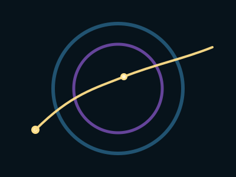

# Dot of Awareness

## **The Dot That Decides to Move**

#### _Lesson One of the Avalanche of Kindness Shape Grammar_

In every system—biological, emotional, organizational, or technological—transformation begins not with a plan, but with a **point of potential**.

Klee described a line as _“a dot that went for a walk.”_\
In the Avalanche of Kindness grammar, the **dot** is more than a geometric artifact:

It is a **moment of awareness**.\
A **pause**.\
A **choice-point** where a human being decides how to meet the world.

The dot appears before action, before strategy, before systems.\
It is the seed of consciousness inside complexity.

***

### **1. The Dot as Awareness**

The dot is the smallest unit of kindness.

It is the instant you notice your shoulders tensing in a meeting.\
It is the breath before you respond to an emotionally charged message.\
It is the flicker of intuition that says, “Something here needs gentleness.”

In the AoK grammar, the dot symbolizes the **first interruption of autopilot**—\
the micro-moment where a new trajectory becomes possible.

The dot does not know yet where it will go.\
But it knows it has a choice.

***

### **2. The Dot as a Relational Pivot**

Every system contains repeating relational patterns:

* defensiveness
* escalation
* shutdown
* avoidance
* overcommitment
* domination
* appeasement

These patterns are attractors—loops of thought, emotion, and behavior.

A dot is the point where a person, team, or system briefly exits its habitual orbit.

This is the birthplace of:

* courage
* repair
* generative tension
* creativity
* compassion

A dot is not dramatic.\
It is subtle, almost invisible—but powerful enough to re-route entire futures.

***

### **3. The Dot as the Beginning of the Walk**

When the dot _moves_, it becomes a **kindness line**.

Not a sentimental gesture, but a **path through tension**:

* bending instead of breaking,
* curving instead of snapping,
* exploring instead of defending.

The dot that chooses to move with care initiates the first phase of systemic change:

> **A shift from reactive motion to intentional motion.**

This is where agency is born.

***

## **Leadership Narrative: Why the Dot Matters in Phase Transitions**

Leaders often feel pressure to respond at scale:

* Transform the culture.
* Resolve the conflict.
* Redesign the organization.
* Navigate technological upheaval.
* Guide teams through uncertainty.

But large systems seldom change through large interventions.\
They change through **numerous tiny shifts in how people meet tension**.

The AoK dot gives leaders three essential insights:

***

### **Leadership Insight 1: Systems Change Begins at the Smallest Scale**

A system is changed one micro-interaction at a time.

The dot teaches:

> _“Your smallest gesture carries systemic significance.”_

A calm breath before a meeting changes the relational field.\
A single acknowledgment of someone’s pain changes their trajectory.\
A curious question interrupts the escalation pathway.

The dot is where leaders quietly reshape the system’s attractor landscape.

***

### **Leadership Insight 2: Awareness Precedes Strategy**

Most attempts at transformation fail because people apply new strategies while remaining in old states of consciousness.

The dot reminds leaders:

* Awareness is not optional.
* Somatic attunement and emotional clarity matter.
* A shift in internal stance precedes any shift in external structure.

The leader’s nervous system becomes part of the system’s architecture.\
The dot is where leaders choose what kind of architecture they want to embody.

***

### **Leadership Insight 3: The Dot Protects Dignity**

The moment between stimulus and response is where dignity is either preserved or eroded.

A leader who honors that moment:

* disrupts cycles of harm,
* models psychological safety,
* encourages reflective culture,
* shows teams how to navigate complexity without collapse.

Thus:

> **The dot is the smallest unit of institutional integrity.**

When leaders discipline this moment, entire ecosystems become more humane.

***

## **A Practice for Leaders and Learners**

Throughout your day, notice the dots:

* Before answering an email
* Before giving feedback
* Before assuming intent
* Before escalating tension
* Before withdrawing
* Before making a decision in fatigue or fear

Pause long enough to let the dot become a choice.\
Ask:

1. **What line am I about to draw?**
2. **What does care look like as a direction?**
3. **How can my next gesture improve the relational field?**

You don’t need to solve the whole system.\
Start by giving your dot the option to walk differently.

***

## **SVG: The Dot Beginning Its Walk**

This minimal diagram shows:

* the **gold dot** (awareness),
* the **kindness line** bending through the system,
* the **teal and violet** circles representing structure + integration fields.

<figure><figcaption></figcaption></figure>


