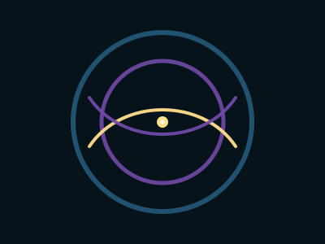

# Emotional Trajectories

## **Emotional Trajectories: Hope, Relief, and Integration**

#### _Lesson Three of the Avalanche of Kindness Shape Grammar_

Human movement is not only physical.\
It is emotional, cognitive, somatic, relational.

Every gesture carries a feeling-tone, a curvature of the inner world.

In the Avalanche of Kindness grammar, the **line** that began as awareness (the dot) and curved around resistance (dinergy) now evolves into **arcs** that encode emotional states.

This is where the geometry becomes alive—\
where shapes stop representing abstractions and begin representing lived experience.

***

## **1. Emotional Motion Is System Motion**

Emotional trajectories are not “soft.”\
They are structural drivers:

* hope increases exploration,
* fear increases rigidity,
* relief restores connection,
* shame collapses agency,
* curiosity bridges differences,
* compassion stabilizes networks.

In complex adaptive systems, **emotion shapes behavior**, and behavior shapes culture.

So the AoK grammar gives us a way to visualize emotional dynamics directly.

***

## **2. The Hope Arc: A Bend Toward Possibility**

The **hope arc** is a gentle upward curve.

It is gold, warm, and slightly lifted—\
a gesture that says:

> “Maybe there is a way through.”

Hope is not optimism.\
It is **directional orientation**, the willingness to move toward the unknown with openness.

The hope arc appears when:

* someone feels seen,
* a new idea sparks meaning,
* a conflict finds momentum toward repair,
* a team senses that their effort matters.

In the diagram, the hope arc rises from left to right—\
a visual metaphor for an emotional lift.

***

## **3. The Relief Arc: A Softening of Pressure**

Relief is a downward curve—\
a gentle settling, a return from activation to safety.

In the AoK grammar, the relief arc is often drawn in violet:

* not the gold of aspiration,
* not the teal of boundaries,
* but the integrated tone of **exhale**.

Relief arrives when:

* tension is acknowledged,
* a boundary is clarified,
* someone finally says the truth,
* the nervous system stops bracing.

Relief arcs restore **capacity**.\
Without relief, hope becomes brittle.

***

## **4. Integration: When Arcs Form Wholes**

When hope and relief are both present—\
when a system cycles between lift and settling—\
something new appears:

#### **an integration loop.**

This loop is a circle-like form created by the joining of:

* an upward hope arc,
* a downward relief arc.

Integration loops encode learning, wholeness, and the capacity to metabolize experience.

When a team or community enters integration, they become:

* less reactive,
* more reflective,
* more creative,
* more resilient.

This is the emotional signature of healthy phase transitions.

***

## **Leadership Narrative: Managing Emotional Thermodynamics**

Emotion is not noise in a system.\
It is part of the system’s _physics_.

Leaders who ignore emotional dynamics lose visibility into the forces shaping their organization. Leaders who learn to read and respond to emotional trajectories become capable of gently steering complex systems without coercion.

Here are the key leadership insights for Lesson Three.

***

### **Leadership Insight 1: Hope Is Not Optional**

A system without hope becomes:

* rigid,
* conflict-prone,
* unimaginative,
* risk-averse.

You cannot command hope.\
You can only create **conditions** that allow hope arcs to appear:

* clear purpose,
* psychological safety,
* transparent communication,
* visible progress,
* meaningful acknowledgment.

Hope is the **lift force** in a complex system.

***

### **Leadership Insight 2: Relief Is as Important as Momentum**

Many leaders accidentally suppress relief:

* endless meetings with no completion,
* constant urgency,
* perpetual escalation,
* no pause for digestion,
* no recognition of emotional load.

Without relief, teams stay chronically activated.\
Activation without settling causes burnout and collapse.

Relief arcs are essential because they:

* return the system to baseline,
* reopen curiosity,
* rebuild capacity for risk-taking,
* generate trust.

Relief is the **reset force** in a complex system.

***

### **Leadership Insight 3: Integration Is the Signature of a Regenerative Culture**

When hope and relief are allowed to alternate, the system begins to metabolize complexity.

Integration loops indicate:

* learning instead of defending,
* co-regulation instead of isolation,
* mutual attunement instead of fragmentation,
* adaptive capacity instead of fragile efficiency.

The leader’s task is not to generate constant enthusiasm—\
it is to facilitate **cycles of meaning, settling, restoration, and coherence.**

This is what makes a system anti-fragile.

***

## **A Practice for Leaders and Learners**

Observe the emotional arcs in your work today:

1. **Where do hope arcs appear?**
   * Who creates them?
   * What conditions allow them?
2. **Where are relief arcs missing?**
   * Where does the system never exhale?
3. **Where might an integration loop be forming?**
   * What collective learning is trying to emerge?
4. **What arc are&#x20;**_**you**_**&#x20;embodying now?**
   * Are you lifting, settling, bracing, collapsing, or integrating?

This awareness becomes the basis of emotional stewardship.

***

## **SVG: Hope, Relief, and Integration Arcs**

This diagram shows:

* Gold **hope arc** lifting upward
* Violet **relief arc** softening downward
* A combined **integration loop** forming a partial circle
* Teal and violet holarchy fields representing structural + relational context

<figure><figcaption></figcaption></figure>


