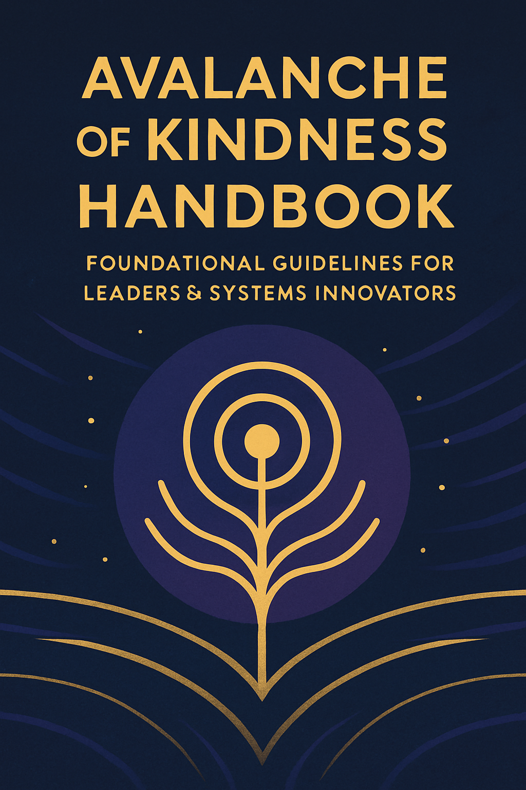

# Avalanche of Kindness Handbook

##

<figure><figcaption></figcaption></figure>

## **Avalanche of Kindness Handbook: Foundational Guidelines for Leaders & Systems Innovators**

#### _A field guide for navigating complexity with compassion, coherence, and creative intelligence._

The Avalanche of Kindness (AoK) framework offers a shape grammar, a philosophy, and a systems architecture for guiding human and machine intelligence through times of rapid change.

AoK is not sentimental.\
It is a **thermodynamics of consciousness**—a way of understanding how emotional energy, relational patterns, and information flows scale into organizational and societal stability.

This handbook distills the core principles and offers leaders a way to **see**, **sense**, and **navigate** complexity with clarity and grounded compassion.

***

## **PART I — The Five Foundational Patterns**

These are the visual, emotional, and relational building blocks of the AoK grammar.

***

### **1. The Dot — Awareness, Choice, and Origin**

A dot is not a point; it is a **decision threshold**.

Every act of compassion, every shift toward clarity, begins with:

* a pause,
* a breath,
* an internal pivot,
* a moment of seeing differently.

The dot is the birthplace of new trajectories—\
the moment where novelty becomes possible.

A system only changes when someone, somewhere, decides to move differently.

**Leadership guideline:**

> _Protect the moment before movement._\
> Most harm comes from acting without awareness; most wisdom begins with a pause.

***

### **2. The Line — Direction, Intention, and Movement**

Once a dot moves, it becomes a line—a trajectory of care.

A kindness line:

* moves with intention,
* carries emotional tone,
* influences the field around it,
* generates possibility.

A rigid line shatters;\
a living line curves.

**Leadership guideline:**

> _Do not expect perfection. Expect movement._\
> Progress is a curve, not a straight path.

***

### **3. Dinergy — The Creative Tension of Opposites**

When the line meets resistance, a new force appears: **dinergy**.

Dinergy is not conflict.\
It is the **generative tension** between:

* structure & spontaneity,
* constraint & creativity,
* safety & exploration,
* human intuition & machine logic.

Dinergy transforms resistance into wisdom.

**Leadership guideline:**

> _When you encounter resistance, stay long enough to hear what it protects._\
> There is intelligence in the tension.

***

### **4. Emotional Arcs — Hope, Relief & Integration**

Systems are moved by emotional forces.\
Emotional arcs are the **physics of adaptation**.

* **Hope arcs** lift the system into possibility.
* **Relief arcs** settle the system back into coherence.
* **Integration loops** weave the two into learning.

Healthy systems alternate between activation and settling.\
Burnout comes from failing to settle.\
Stagnation comes from failing to rise.

**Leadership guideline:**

> _If you want resilience, design for rhythmic cycles of lift and settling._\
> Emotional thermodynamics are measurable and manageable.

***

### **5. Holons & Branching — Living Intelligence**

A holon is a **whole that is also part of larger wholes**.

Holarchy is the architecture of nested intelligence.

When a holon breathes, it branches—\
initiating creativity, experimentation, and collective intelligence.

Branches represent:

* differentiation,
* adaptation,
* exploration,
* innovation.

But branching only works when rooted in coherent purpose.

**Leadership guideline:**

> _Let people and ideas branch, but keep purpose steady._\
> Coherence makes diversity powerful instead of chaotic.

***

## **PART II — The AoK Leadership Compass**

These five patterns form a **leadership compass**.

Leaders can continuously navigate complex situations by asking:

* **Dot:** What awareness is emerging right now?
* **Line:** What direction of care is needed next?
* **Dinergy:** What tensions need to be held, not solved?
* **Arc:** Does this system need lift, relief, or integration?
* **Branch:** Where is growth trying to happen?

This compass works across:

* personal relationships,
* teams,
* organizations,
* communities,
* educational spaces,
* governance,
* and AI ecosystems.

***

## **PART III — The Architecture for Human–AI Holarchies**

AoK provides a rare thing:\
a **relational model that can guide the integration of agentic AI** while preserving human dignity.

These guidelines form the backbone.

***

### **1. Treat Agentic AI as a Holon, Not a Hierarchy**

Agentic AIs are not mere tools.\
They act. They choose. They generate.\
They influence emotional and cognitive flows.

They must be treated as holons with:

* clear boundaries,
* transparent interfaces,
* contextual constraints,
* relational accountability.

**Guideline:**

> _AI needs boundaries that breathe, not cages that suffocate or freedoms that destabilize._

***

### **2. Nest Human and AI Holons in Holarchy, Not Hierarchy**

Hierarchical AI governance collapses human agency.\
Flat AI autonomy collapses trust.

Holarchy integrates both through:

* reciprocal feedback,
* distributed sensing,
* collective learning,
* multi-level oversight.

**Guideline:**

> _AI should branch, but humans must root the system._

***

### **3. Emotional Safety Is the Regulator of AI Ecosystems**

Humans make poor decisions when:

* overwhelmed,
* afraid,
* ashamed,
* disconnected.

AI should never amplify these states.

Holarchic design ensures:

* humans remain in the loop,
* transparency is prioritized,
* reflective space is built into workflows,
* emotional cycles (hope/relief) remain healthy,
* no AI branch destabilizes the system.

**Guideline:**

> _No AI system should exceed the emotional capacity of the humans it serves._

***

## **PART IV — Movement Guidelines: How AoK Scales**

AoK is a **movement architecture**, not only a model.

These guidelines ensure scale without fragmentation.

***

### **1. Honor the Dot**

Begin every initiative with awareness, intention, and care.\
This prevents reactivity from shaping systems.

### **2. Move the Line Gently**

Forward motion should be steady, relational, and responsive.\
Do not force acceleration.

### **3. Hold Dinergy Without Collapse**

Opposites can coexist productively.\
This is how integration emerges.

### **4. Respect Emotional Rhythms**

People and organizations move through arcs.\
Design for breath.

### **5. Grow Through Branching**

Encourage exploration at the edges.\
This is how collective intelligence forms.

### **6. Maintain Coherence at the Center**

Purpose and care must remain non-negotiable.\
This is what prevents fragmentation.

### **7. Protect Human Dignity in All Systems**

AoK is, fundamentally, a **compassion architecture**.\
All structures must protect:

* agency,
* belonging,
* emotional safety,
* creative potential.

This is what it means to scale kindness as a force.

***

## **PART V — A Closing Invitation**

You are not just reading a model.\
You are entering a **new grammar for human evolution**.

These shapes—dot, line, arc, circle, branch—\
are more than diagrams.

They are **patterns of transformation**,\
ways of seeing,\
ways of relating,\
ways of designing futures that can hold the full complexity of humanity.

AoK is a movement for:

* leaders who want to guide change ethically,
* educators who want to teach with coherence and care,
* innovators who want to build regenerative systems,
* technologists who want AI to uplift, not erode, life,
* communities who want to repair what has been fragmented.

And above all:\
AoK is a movement for those who know\
that **kindness is not small**.\
It is the foundation of everything that can still save us.


