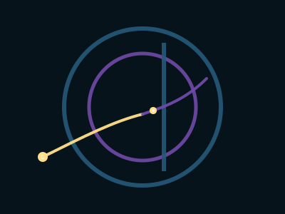

# Resistance & Dinergy

## **Meeting Resistance: The Birth of Dinergy**

#### _Lesson Two of the Avalanche of Kindness Shape Grammar_

In Lesson One, we met the **dot**—a moment of awareness—and watched it become a **kindness line** going for a walk through a complex field.

But no real walk stays smooth for long.

Sooner or later, the line encounters resistance:

* a rigid process,
* a defensive reaction,
* a structural constraint,
* a clash of values,
* a political limit,
* a technological boundary.

This is where most systems get stuck.\
It’s also where something new can be born.

***

### **1. When the Line Meets a Wall**

Imagine the kindness line moving through a field of teal and violet—\
a human act of care moving through structures and collective meaning.

Then it meets a vertical force:\
a rule, a gatekeeper, a deadline, a budget, a trauma response.

There are three common reactions:

1. **Snap** – the line breaks into frustration, withdrawal, or aggression.
2. **Flatten** – the line conforms completely and disappears into the wall.
3. **Curve** – the line bends, adapting without abandoning its intention.

In AoK grammar, the third option is where **dinergy** emerges.

***

### **2. Dinergy: Opposites Held in Generative Tension**

Dinergy is what happens when two seemingly opposing forces:

* structure and spontaneity,
* control and freedom,
* efficiency and care,
* individual needs and collective good,
* human intuition and machine optimization,

do **not** annihilate each other,\
but instead enter a **relationship of creative tension**.

Visually, we express this as:

* **gold** (warm kindness, human empathy)
* meeting **teal** (cool structure, constraints)
* and producing **violet** (integration, insight, new pattern).

At the point of contact, the kindness line **changes color**:

* before the encounter, it’s gold;
* as it bends around resistance, it shifts into violet.

This color shift encodes a deep idea:

> **Mature kindness is not naïve.**\
> **It metabolizes resistance into wisdom.**

***

### **3. The Emotional Physics of Phase Change**

Phase transitions in complex systems—social, ecological, psychological, technological—are often experienced as **increased tension**.

The kindness line meeting the wall represents:

* a conversation that becomes charged,
* a reform blocked by legacy interests,
* an innovation constrained by risk,
* a community effort colliding with bureaucracy.

At such moments, the choice is not between “kindness” and “strength.”\
The question is:

> **Can we stay in relationship with the tension long enough for a new form to emerge?**

In AoK terms:

* The gold line stays committed to care.
* The teal wall stays committed to structure.
* The bend into violet marks the birth of a **third possibility**.

This is dinergy:\
a field in which _neither_ side collapses the other,\
and the system reorganizes at a higher level of coherence.

***

## **Leadership Narrative: Working with Resistance Instead of Fighting It**

For leaders navigating large transitions—AI integration, organizational redesign, justice work, climate-related shifts—resistance is not a sign of failure. It is **a sign that energy is present**.

The dinergy lens offers three pivotal reframes.

***

### **Leadership Insight 1: Resistance Is Structured Care**

Most resistance protects something:

* safety,
* identity,
* past effort,
* scarce resources,
* unhealed wounds.

If we treat resistance as “the enemy,” we miss the intelligence it carries.

Dinergy asks leaders:

* _What is this resistance trying to care for?_
* _What fear or value is it defending?_
* _What would it take for that care to be honored in a healthier form?_

This transforms resistance from “blockage” into **information**.

***

### **Leadership Insight 2: Don’t Choose a Pole—Hold the Field**

In polarized systems, leaders are often pressured to pick a side:

* move fast vs move safely,
* protect margins vs protect people,
* preserve stability vs push innovation,
* trust machines vs trust humans.

Dinergy doesn’t tell leaders to sit on the fence.\
It teaches them to **hold the whole field**:

* clearly naming the poles,
* acknowledging the legitimate concerns of each,
* refusing to resolve tension prematurely,
* inviting co-creation of a third pattern.

This is not indecision.\
It is **phase-change facilitation**.

The leader becomes the space in which a gold line and a teal wall can coexist long enough to produce violet.

***

### **Leadership Insight 3: Design Containers That Can Absorb Tension**

When systems lack safe containers, tension spills out as:

* blame,
* scapegoating,
* burnout,
* silent disengagement,
* performative compliance.

AoK-inspired design asks:

* Where does tension go in this team?
* Do we have spaces where resistance can be expressed without punishment?
* Are we equipped to metabolize strong emotions and disagreements?
* Do we have rituals and rhythms that allow the line to bend instead of break?

Holarchic circles, psychological safety practices, clear agreements, and embodied reflection all serve as **containers for dinergy**.

The goal is not to eliminate resistance—but to make sure it **has somewhere wise to go**.

***

## **A Practice for Leaders and Learners**

The next time you feel resistance—either _in yourself_ or _in someone else_—try this:

1. **Name the Wall**
   * What does this resistance appear to be protecting?
   * Can you name the value or fear without judgment?
2. **Find the Line**
   * Where is the “kindness line” in this moment?
   * What is your sincere caring or long-term intention here?
3. **Imagine the Bend**
   * If neither side were forced to disappear,
   * what small curve in the path might create a new possibility?

You don’t need the whole solution.\
You just need the next bend.

***

## **SVG: The Kindness Line Meets Resistance**

This diagram shows:

* the **teal circle** (system/structure),
* the **violet inner ring** (integration field),
* a **teal vertical bar** (resistance / constraint),
* a **gold line** approaching the wall,
* and a **violet segment** as the line bends around it—\
  the moment dinergy appears.

<figure><figcaption></figcaption></figure>


