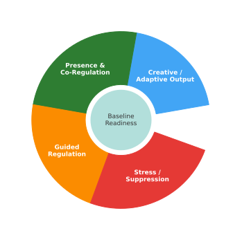

# Regenerative cycle

## Regenerative Cycle

<figure><figcaption>
Regenerative Cycle – Integrating Shadow into Wisdom
</figcaption></figure>

> **Summary**\
> Stress enters the system → Guided Regulation cools energy → Presence & Co‑Regulation restores attunement → Creative Output returns vitality to Baseline Readiness.\
> A small white gap symbolizes renewal and the ever‑present potential for new challenge.

### Why this matters to VI

* **Embodiment**: maps thermodynamic energy to felt sense.
* **SOC Link**: the cycle keeps the nervous system at criticality instead of collapse or chaos.
* **NsK Tie‑in**: self‑kindness + co‑regulation are the hinge points.
