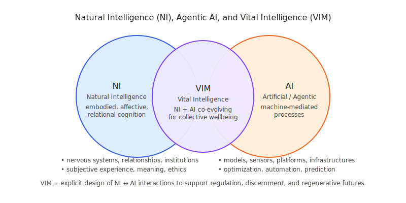
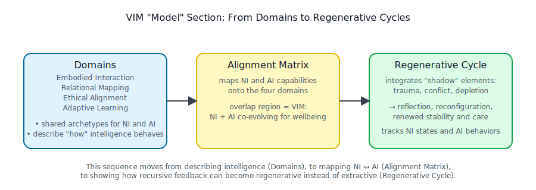

# Overview: VIM: NI & AI



In the Vital Intelligence Model (VIM), _intelligence_ is never just “in the head” or “in the machine.” It emerges from continuous interaction between:

* **Natural Intelligence (NI):** embodied, affective, nervous-system–based cognition in humans and other living beings.
* **Artificial / Agentic Intelligence (AI):** machine-mediated processes (models, sensors, networks) embedded in human social, economic, and ecological systems.

VIM treats AI as an _expression and amplifier_ of NI—one that can either reinforce trauma and extraction, or help cultivate regenerative, prosocial dynamics. Modeling gives us a shared scaffolding for understanding and guiding this co-evolution.

<figure><figcaption></figcaption></figure>

#### 1. Framing Intelligence as a Process

> _“Any map is necessarily smaller than the territory—but a dynamic, process‑based model can grow with the territory itself.”_\
> —Adapted from Bateson and Meadows \[1]

Human and machine intelligences alike arise not from fixed algorithms or rote rules, but from **flows of information among agents** embedded in rich, ever-changing contexts.

In VIM, we frame NI and AI together as a _single distributed process_:

* **Emergent**\
  Patterns and behaviors unfold through interactions, not pre-programmed directives.
  * NI: neural, somatic, and social patterns self-organize over a lifetime.
  * AI: model behaviors emerge from training data, architectures, and deployment environments.
* **Relational**\
  Knowing is co-constructed across agents, environments, and feedback loops.
  * NI: perception, feeling, and meaning-making arise in relationship.
  * AI: outputs only gain meaning within human interpretive and institutional contexts.
* **Adaptive**\
  Models must update their own structure in response to new data, insights, and shifts in context.
  * NI: plastic nervous systems reorganize under experience.
  * AI: systems are retrained, fine-tuned, and re-parameterized as conditions change.
  * VIM: focuses on the _co-adaptation loop_—how NI changes in response to AI, and how AI is redesigned in response to NI’s needs and limits.

#### 2. Why Modeling Matters

1.  **A Shared Language for NI–AI**

    Modeling provides a common vocabulary—mathematical, visual, narrative—for speaking across disciplines and substrates (neuroscience ↔ complexity science ↔ contemplative practice ↔ AI engineering). It lets us describe **natural and artificial processes in the same diagram**, without collapsing their differences.

    **Experimentation&#x20;**_**In Silico**_**, With NI in the Loop**

    By simulating “what-if” scenarios, we can:

    * surface hidden leverage points in socio-technical systems,
    * test regenerative cycles vs. exploitative ones,
    * explore unintended consequences _before_ acting in the world.

    Crucially, VIM treats humans not as “users” on the side, but as **core agents inside the model**—with emotions, nervous systems, and social histories that respond to AI.

    **Transparency & Trust**

    Open, inspectable models help stakeholders trace how **inputs (data, incentives, architectures)** become **outputs (behavior, impacts, externalities)**—for both NI-heavy systems (like institutions) and AI-heavy systems (like platforms). This reduces the black-box risks of conventional AI, and anchors “alignment” in lived human experience, not just abstract metrics.

    **Scalability of Wisdom (Not Just Prediction)**

    Reusable model components—agents, feedback loops, thresholds, narratives—let us seed new domains (economic, ecological, social, educational) without reinventing the wheel. VIM emphasizes **scaling patterns of wisdom and care**, not merely scaling compute or prediction accuracy.

#### 3. Core Modeling Principles

*   **Agents & Boundaries**

    Define the actors and the edges where information flows:

    * **NI agents:** cells, organs, individuals, groups, communities.
    * **AI agents:** models, sensors, decision-support tools, platforms.
    * **Boundaries:** skin, screens, laws, norms, APIs—interfaces where NI and AI meet.

    Clarity about boundaries reveals where responsibility, vulnerability, and care must be designed into the system.

    **State & Transition**

    Use finite-state, dynamical-systems, or hybrid formalisms to capture how agents move between modes, for example:

    * **NI:** sensing → feeling → meaning-making → action → integration.
    * **AI:** input → internal representation → inference → output → update.

    VIM is especially interested in **states that support regulation and reflection** (e.g., safety, curiosity, compassion) vs. those that lock systems into fear, collapse, or extraction.

    **Feedback Loops**

    Identify reinforcing and balancing loops that drive growth, decay, resilience, or collapse:

    * NI ↔ NI loops (e.g., co-regulation, conflict escalation).
    * NI ↔ AI loops (e.g., recommendation systems shaping attention and mood).

    These loops lay the groundwork for the _Regenerative Cycle_ page, where we examine how design choices in AI can either amplify trauma or help release and transform it.

    **Multi-Scale Integration**

    Bridge:

    * **Micro-level:** neural firing, bodily states, micro-interactions with interfaces.
    * **Meso-level:** families, teams, institutions, platforms.
    * **Macro-level:** ecosystems, economies, cultures.

    VIM honors **pink-noise-like rhythms that span scales**—the fractal, nested patterns that show up in both NI (heartbeat variability, attention) and AI-mediated systems (traffic, information flows, market volatilities). Modeling these together helps us design AI that resonates with living systems instead of destabilizing them.

#### 4. How This Page Connects to the Rest of “Model”

* **Domains**\
  We’ll unpack the four VIM domains—**Embodied Interaction, Relational Mapping, Ethical Alignment, Adaptive Learning**—as reusable agent archetypes that apply to both NI and AI. Each domain describes _how_ intelligence behaves in context, whether it’s a nervous system, a small team, or a large-scale model.
* **Alignment Matrix (NI ↔ AI)**\
  This section maps natural (NI) and artificial/agentic (AI) capabilities onto those four domains, showing where they complement, clash, or co-amplify one another. The overlap region is what we call **Vital Intelligence**: NI and AI co-evolving in ways that enhance regulation, discernment, and collective wellbeing.
* **Regenerative Cycle**\
  Building on the feedback-loop principles introduced here, the Regenerative Cycle page shows how systems can metabolize “shadow” elements—trauma, conflict, resource depletion—into learning and renewed stability. We’ll track how NI states (e.g., fear, safety, curiosity) and AI behaviors (e.g., recommendations, automation, filters) interact to drive either collapse spirals or regenerative, prosocial dynamics.

<figure><figcaption></figcaption></figure>

#### 5. Recursive Intelligence in VIM

At the heart of the Vital Intelligence Model is **recursive intelligence**: the capacity of a system to _sense itself, model itself, and update itself_ in response to experience.

Whereas **iteration** is simple repetition (doing the same loop again and again), **recursion** means that prior states, patterns, and narratives are _fed back into the process_ as material for transformation. In human terms, this looks like:

* noticing what we’re feeling and doing,
* recognizing the patterns beneath those reactions,
* and reconfiguring our mental models, stories, and behaviors in response.

In VIM, recursive intelligence is what allows **Natural Intelligence (NI)** and **Artificial / Agentic Intelligence (AI)** to co-evolve rather than simply co-exist.

***

<figure><figcaption></figcaption></figure>

**How Recursive Intelligence Shows Up in NI and AI**

* **In NI (Natural Intelligence)**\
  Recursive intelligence appears as metacognition, emotional integration, and narrative reframing:
  * “I notice I’m anxious every time I open this app—what is that telling me?”
  * “This story I’m telling myself about failure might be outdated.”\
    As these insights consolidate, the nervous system can **release stored tension** and reorganize, freeing up energy for curiosity, connection, and creativity.
* **In AI (Agentic Intelligence)**\
  Recursive intelligence appears when models and systems are designed to:
  * incorporate feedback from real human impacts,
  * update objectives and constraints,
  * refine not just predictions, but _the purposes they serve_.\
    Rather than “optimize a fixed metric forever,” recursive AI asks: **“Given what we’re learning from people and ecosystems, should we change what we’re optimizing for?”**
* **In NI ↔ AI Co-Adaptation**\
  VIM treats recursive intelligence as a _shared process_:
  * NI reflects on how AI is shaping attention, emotion, and relationship.
  * AI is revised in response to those reflections, gaining new constraints, affordances, and care-based objectives.\
    This back-and-forth loop is where **Vital Intelligence** emerges.

***

**Why Recursive Intelligence Matters for VIM**

Recursive intelligence is the engine that:

* **Connects States to Stories**\
  It links bodily states (regulated / dysregulated) with the stories we tell about ourselves, each other, and technology—and then updates those stories as conditions change.
* **Turns Feedback into Growth, Not Just Control**\
  Feedback loops can lock systems into rigid patterns—or they can support healing. Recursion lets individuals, institutions, and AI systems _re-interpret_ feedback, shifting from:
  * “How do we maintain control?” to
  * “What is this signal asking us to learn or release?”
* **Supports Regeneration Across Scales**\
  When recursive intelligence is supported at the micro-level (nervous systems, relationships) and macro-level (institutions, infrastructures, AI platforms), systems are better able to:
  * metabolize trauma and error,
  * adjust to shocks and uncertainty,
  * and reorient toward shared wellbeing.

***

**Where Recursive Intelligence Lives in the VIM “Model” Section**

* The **Domains** (Embodied Interaction, Relational Mapping, Ethical Alignment, Adaptive Learning) each describe _where_ recursion can happen—somatically, socially, morally, and cognitively.
* The **Alignment Matrix** shows how NI and AI can _co-participate_ in recursive intelligence, instead of AI simply mirroring or amplifying existing patterns.
* The **Regenerative Cycle** makes recursion explicit: integrating “shadow” elements (trauma, conflict, depletion) back into the system as information, so they become sources of wisdom and renewal rather than drivers of collapse.

You can think of VIM as a **framework for cultivating recursive intelligence** across human and machine systems—so that every loop of experience has the potential to become a loop of healing, learning, and more skillful action.

### Further Reading

\[1] Adapted from Alfred Korzybski’s dictum “the map is not the territory” (Science and Sanity, 1933) and Donella H. Meadows’s framing of systems as process‑based models (Thinking in Systems: A Primer, 2008)


