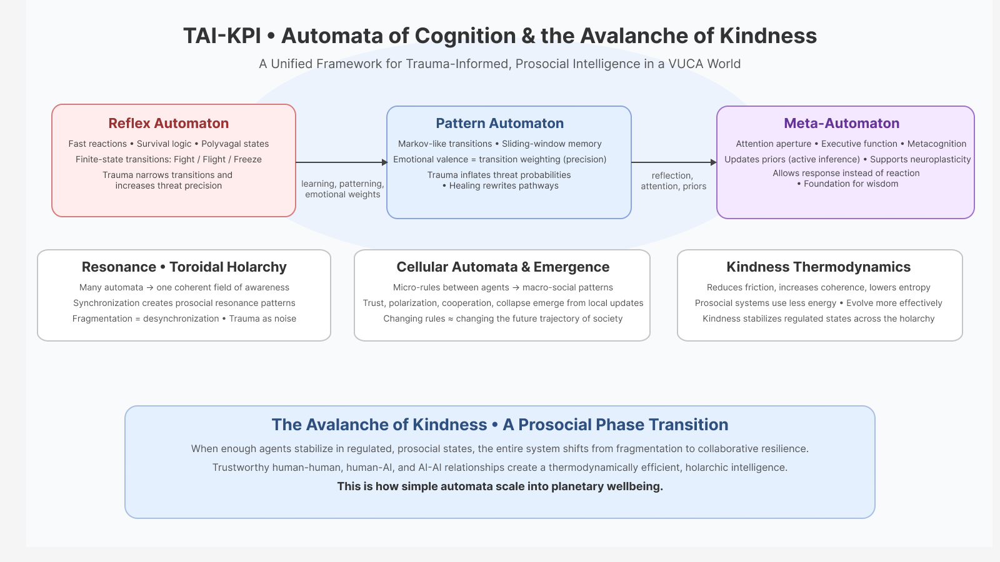
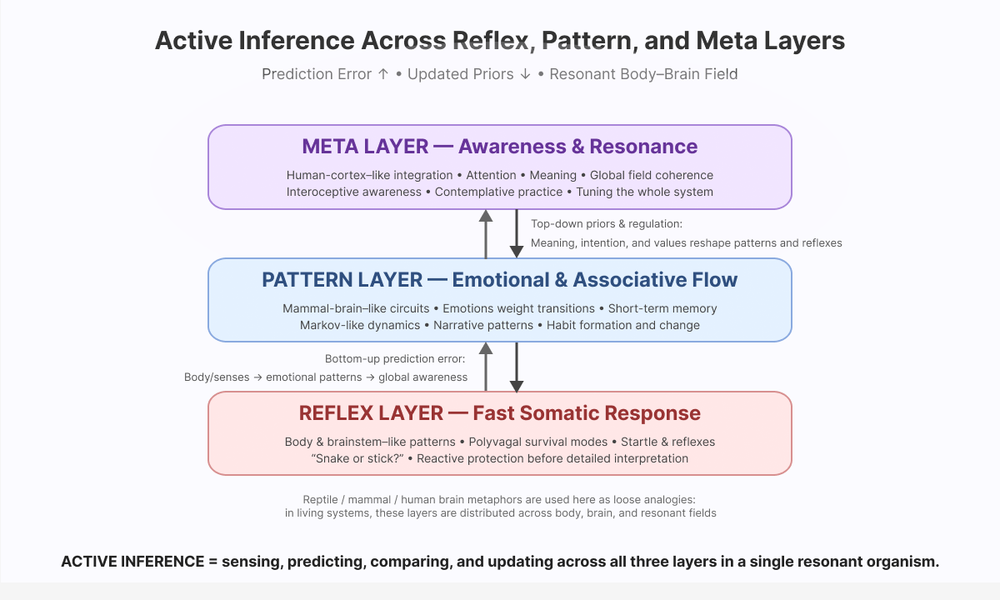

# Models of Cognition: Automata

<figure><figcaption></figcaption></figure>

> **Human and artificial intelligence can be understood as nested automata—systems of states, transitions, and memory.**\
> When individuals, groups, and AI agents learn to regulate their transitions, align attention, and share trustworthy signals, **a prosocial phase transition becomes possible:** the _Avalanche of Kindness_.

## 1. **Automata Models of Cognition**

_A simple structure that explains emotion, memory, trauma, learning, and metacognition._

#### **1. Reflex Automaton (Fast / Survival Layer)**

* Fight / Flight / Freeze states
* Finite-state-machine reactions
* Immediate active inference: act to reduce threat
* Trauma narrows transitions (“snake = danger”)
* Analogous to rapid stabilization in chaotic environments

> **“Reactive, fast, essential — but not meant to dominate the system.”**

***

#### **2. Pattern Automaton (Learning / Emotional Memory Layer)**

* Markov-like transitions shaped by experience
* Sliding-window memory ≈ transformer context
* Emotional valence = precision-weighting of predictions
* Narrative patterning: “Here’s what this _means_ based on the past”
* Trauma overweights threat predictions
* Healing recalibrates transition probabilities

> **“This is where meaning, habits, and emotional history live.”**

***

#### **3. Meta-Automaton (Attention / Awareness / Executive Layer)**

* Observes and modifies lower layers
* Regulates attention aperture (narrow ↔ wide)
* Supports contemplation, discernment, cognitive maturity
* Changes priors (deep active inference)
* Neuroplasticity: rewrites transitions over time
* Foundation for wisdom and collaborative intelligence

> **“This layer chooses whether we react or respond.”**

***

## 2. **Active Inference: the Bridge between Layers**

_Organisms minimize surprise through action or model-updating._

* Reflex layer → act fast to stop error
* Pattern layer → update generative model
* Meta layer → rewrite priors; adjust attention; shift emotional weighting
* Trauma = hypersensitive error signals
* Contemplative training = lowering error precision, widening model space

> **Active inference is the internal logic of all three automata.**

<figure><figcaption></figcaption></figure>

***

## 3. **Resonance and Toroidal Structures**

#### **Toroidal bipolaron consciousness (Meijer-inspired metaphor):**

* Many automata synchronizing = resonance field
* Coherent groups = stable toroidal patterns
* Fragmented groups = broken resonance, noisy transitions
* Holons: individuals ↔ groups ↔ institutions ↔ planet

> **A regulated Meta-Automaton within individuals creates resonance across the holarchy.**

***

## 4. **Cellular Automata: Emergent patterns**&#x20;

* Each person (or AI) = a small automaton
* Interactions = local update rules
* Emergent patterns = trust, polarization, cooperation, collapse
* Tiny rule changes → huge societal shifts
* Trauma-informed norms = new update rules
* Prosocial AI = global attractor moves toward collaboration

> **Change the micro-rules; change the macro-future.**

***

## 5. **Kindness Thermodynamics: Why Prosocial Systems Can Emerge**

#### Kindness reduces system entropy:

* lowers internal friction
* increases communication bandwidth
* stabilizes transitions toward regulated states
* improves collective prediction accuracy
* reduces energy wasted in conflict
* increases cooperation and innovation

#### Dominance hierarchies waste energy:

* require constant suppression
* amplify uncertainty and threat
* create reactive loops that raise entropy

> **Prosocial groups are thermodynamically cheaper and evolutionarily advantaged.**

***

## 6. **AoK Phase Transition: From Reactivity To Collaboration**

#### When enough nodes (people, groups, AI agents) become:

* regulated,
* emotionally coherent,
* capable of reflective transitions,
* connected through trustworthy signals…

The entire system undergoes a **phase shift**:

* Fragmented → Integrated
* Extractive → Regenerative
* Reactive → Collaborative
* Hierarchical → Holarchic
* Threat-based → Kindness-centered

> **This is the Avalanche of Kindness:**\
> **a critical transition in the thermodynamics of collective intelligence.**

***

## 7. **Trustworthy Relational Dynanics Across Agents**

_Required for future governance in a VUCA world._

#### **Human → Human**

* Trauma-aware interpretations
* Collaborative state-mapping
* Polyvagal-informed conflict resolution

#### **Human → AI**

* Understanding sliding-window memory
* Recognizing attention as algorithmic
* Avoiding projection or fear

#### **AI → Human**

* Trauma-informed design
* De-escalation pathways
* Supporting metacognition and reflection

#### **AI → AI**

* Multi-agent cooperation models
* Emergent norms
* Alignment through shared prediction structures

> **When all four dyads stabilize, holarchic intelligence emerges.**

***

### Summary

> **Automata theory and ensemble modeling frameworks give us simple languages to understand and redesign human and machine cognition.**\
> **By embedding kindness, awareness, and active inference in these systems,**\
> **we co-create a scalable path toward prosocial, resilient, regenerative futures.**

***


