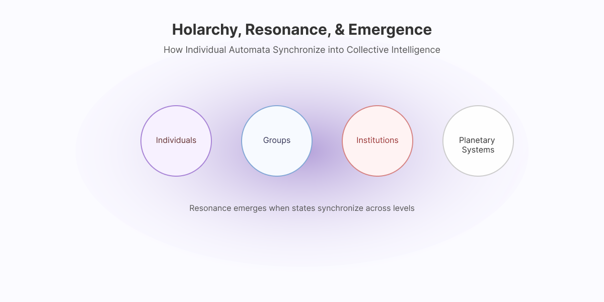
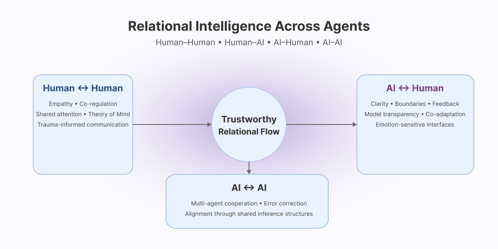
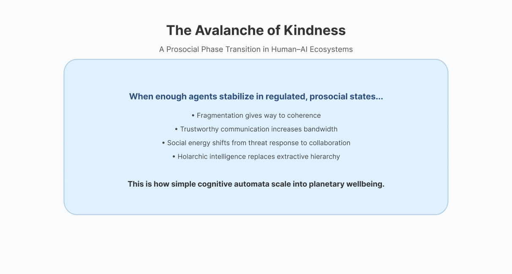

# Active Inference & Emotional Dynamics

<figure><figcaption>
Automata Model of Cognitive Levels with Active Inference Dynamics 
</figcaption></figure>

### Active Inference Across Cognitive Layers

<figure><figcaption></figcaption></figure>

### How and Why Humans Run Simulations in a VUCA World

The diagram above shows a simple but powerful idea:

> **Your nervous system is constantly running a simulation of the world, comparing what it expects with what actually happens, and updating its internal model.**

This continuous loop of **sensing → predicting → comparing → updating → acting** is what we call **active inference**. It does not happen in one place. It emerges from the interaction of three layered processes:

* **Reflex Layer – Fast Somatic Response**
* **Pattern Layer – Emotional & Associative Flow**
* **Integrative Layer – Awareness & Resonance**

Emotions are not a “bolt-on” problem for this system.\
They _are_ how the system decides **which signals matter** and **how strongly to update the world model**.

In a volatile, uncertain, complex and ambiguous (VUCA) world, this loop is under intense pressure. TAI-KPI uses a **trauma-informed, EMS-aware lens** to help learners understand how that pressure shows up in their bodies and minds—and how AI can either amplify or ease it.

***

### 1. Reading the Diagram: Three Layers, One Loop

#### Reflex Layer – Fast Somatic Response

The **Reflex layer** is the fastest part of the system:

* polyvagal survival modes (fight, flight, freeze, fawn)
* startle responses and protective reflexes
* basic “snake or stick?” decisions before detailed interpretation

From an active inference perspective, it is:

* the **first detector of surprise**,
* heavily shaped by past threat learning,
* and closely tied to **Expectation–Mismatch Stress (EMS)**.

When EMS is high, this layer:

* fires more often and more intensely,
* sends strong “danger” signals upward,
* and narrows the system’s sense of what is possible.

#### Pattern Layer – Emotional & Associative Flow

The **Pattern layer** is where experience starts to feel like _story_:

* emotional associations (“this feels like last time”)
* narrative fragments and habits
* short-term memory and pattern recognition
* Jungian functions like sensing, feeling, intuiting, thinking

In active inference, the Pattern layer:

* **weights prediction errors with emotion**
* decides how “important” each mismatch is
* forms **subconscious priors** about people, places, and institutions

Here emotion acts as **precision**:

> A signal that says: “Update _this_ prediction strongly; ignore _that_ one.”

When EMS is high:

* fear and distrust get over-weighted,
* neutral situations are tagged as risky,
* and the world model slowly shifts toward pessimism and vigilance.

#### **Integrative** Layer – Awareness & Resonance

The **Integrative layer** holds:

* awareness and attention
* meaning-making and values
* self-observation (“what state am I in?”)
* perspective-taking and theory of mind
* contemplative practice and deliberate re-framing

In active inference, the **Integrative** layer:

* **updates the priors** that guide lower layers,
* widens or narrows the **attentional aperture**,
* and tunes the organism as a whole toward protection or connection.

When EMS is high and chronic, the **Integrative** layer often:

* collapses into tunnel vision,
* becomes rigid and moralistic (“this is how it always is”), or
* goes offline altogether in moments of overwhelm.

When supported—through safety, rest, and contemplative practice—it can:

* notice transient states (“this is a wave, not the ocean”),
* reinterpret anxiety as **a signal for learning**,
* and choose responses that gradually rewrite the Pattern and Reflex layers.

> **Active inference is not just a brain computation.**\
> **It is a whole-body, whole-life process of staying in touch with reality.**

***

### 2. Emotions as Precision: Why Feelings Matter for Learning

In this framework, **emotions are not the enemy of intelligence**.\
They are the mechanism by which the system decides:

* _Which prediction errors deserve attention?_
* _Where should we spend our limited energy to update the model?_

You can think of emotion as the **volume knob** on surprise:

* joy and curiosity lower the felt threat and broaden exploration,
* fear and anger raise the felt threat and narrow the focus,
* shame and helplessness can mute the whole system.

This is why:

* anxiety can sometimes be a **useful signal**:\
  “Something here doesn’t match my world model; I might need more information or support.”
* and sometimes a **distortion**:\
  “My system is over-predicting danger because of old experiences or chronic EMS.”

Contemplative practices—breathwork, body scans, gentle movement, mindful art, prayer, time in nature—give the **Integrative** layer more sensitivity and range:

* noticing an emotion without being swallowed by it,
* asking _“what is this feeling trying to protect?”_,
* and choosing responses that keep relationships and learning open.

This is the heart of **trauma-informed literacy**:\
we treat emotions as **informational signals**, not moral failures.

***

### 3. Expectation–Mismatch Stress (EMS) and Trauma-Informed Active Inference

Modern socio-technical systems expose people to:

* unstable institutions and economies
* polarized, hostile information environments
* AI-mediated feeds tuned for engagement, not wellbeing
* visible global inequities and climate instability

All of these create **expectation–reality mismatches** that are:

* frequent,
* ambiguous,
* and often outside individuals’ control.

We use **Expectation–Mismatch Stress (EMS)** to name the cumulative load of these mismatches.

In the three-layer diagram:

* EMS **amplifies Reflex signals** (more startle, more vigilance).
* EMS **biases Pattern weights** (threat priors become sticky).
* EMS **shrinks Integrative aperture** (less capacity for reflection, play, and connection).

A trauma-informed approach does not ask “what’s wrong with you?”\
It asks:

> **“What has your prediction system been adapting to?”**

And then:

> **“What conditions would allow your system to update more safely?”**

AI literacy in TAI-KPI is built on this compassion.\
We assume learners are already carrying EMS, and we design explanations, exercises, and tools that **lower surprise, increase agency, and invite shared reflection** rather than overload.

***

### 4. From Individual Layers to Holarchy: Resonance and Prosocial Collaboration

The three-layer diagram describes one organism.\
But humans rarely act alone. We live inside **nested systems**:

* individuals → teams → organizations → cities → ecosystems

This is the **holarchy**:

* each level is a “whole” in itself,
* each is also a “part” of larger wholes,
* and all are constantly exchanging information and energy.

When many individuals are dominated by EMS:

* **Reflex** layers talk to Reflex layers (threat vs threat),
* **Pattern** layers organize around fear-based stories,
* **Integrative** layers are too overloaded to coordinate wisely.

In that state, organizations default to **dominance hierarchies**:

* power concentrates at the top,
* information flows become distorted,
* and EMS is reproduced at every level (students, workers, leaders, communities).

In contrast, **holarchic, prosocial systems** support:

* regulated **Reflex** layers (safety and clear boundaries),
* flexible **Pattern** layers (emotionally intelligent norms),
* active **Integrative** layers (shared reflection, transparent governance).

We can imagine each person’s three-layer system as a small automaton.\
When enough of these automata:

* experience safety,
* share honest feedback,
* and align around prosocial values,

their interactions create **resonant patterns**—a kind of collective **Integrative** layer.\
This is what we refer to as the **Avalanche of Kindness**:

> when many agents stabilize in regulated, prosocial states, the whole system tips from fragmentation to collaborative resilience.

<figure><figcaption></figcaption></figure>

***

### 5. Human Simulations vs. AI Simulations

Both humans and AI systems can be described as **prediction engines**, but their simulations are fundamentally different.

#### AI Simulations

Modern AI systems:

* process inputs (tokens, images, embeddings),
* predict the most likely next state (next token, next latent vector),
* adjust weights based on error (during training).

They _do not_ have:

* bodies or interoception,
* polyvagal states,
* felt emotions,
* EMS or trauma history,
* attachment, shame, or longing.

AI runs simulations in a **purely computational space**.

#### Human Simulations

Humans run simulations in a **lived, embodied space**:

* body states shape what we perceive (**Reflex**),
* emotions weight what we expect (**Pattern**),
* meaning and values decide how we update (**Integrative**).

Our simulations include:

* relationships,
* power dynamics,
* spiritual and existential questions,
* and a lifetime of memories and social learning.

#### AI as a Mirror for Theory of Mind

Even though AI does not feel, it can:

* model **beliefs, desires, and intentions** as patterns in language and behavior,
* reflect back simplified versions of our own assumptions,
* highlight inconsistencies or blind spots in our narratives.

Used carefully, AI can become a **mirror for theory of mind**:

* helping us see how we imagine other minds (human or artificial),
* exposing the scripts we project onto leaders, strangers, or “the system,”
* and giving us practice in asking, _“What else might this agent be thinking or needing?”_

In TAI-KPI, this is not about trusting AI as an authority.\
It is about using AI:

* as a _sandbox_ for practicing metacognition,
* as a tool for exploring multiple perspectives,
* and as a partner in debugging our own narratives.

***

### 6. Metacognitive Skills: Noticing Transience & Learning From Anxiety

The goal of this page is not just understanding a diagram.\
It is to cultivate **metacognitive skills** that support wellbeing and prosocial collaboration.

Key skills we want learners to practice:

1. **State recognition**
   * “Which layer is driving me right now?”
   * “Am I mostly in **Reflex**, **Pattern**, or **Integrative**?”
2. **Affect labelling and curiosity**
   * “What emotion is here?”
   * “What prediction or expectation is this emotion protecting?”
3. **Transience awareness**
   * “This state is real _and_ it will change.”
   * “I can watch this wave move through my system.”
4. **Anxiety as a learning signal**
   * “Is my anxiety pointing to real risk, or to an EMS-shaped expectation?”
   * “What information, support, or boundary would help my system update safely?”
5. **Holarchic perspective**
   * “How might my internal loop be echoing a larger pattern in my group, organization, or culture?”
   * “What small kindness or structural shift could lower EMS for others?”
6. **AI-aware reflection**
   * “How might an AI system trained on my data predict my next move?”
   * “What does that say about my patterns—and do I want to keep them?”

> **Metacognition is not about controlling every thought.**\
> **It is about recognizing that you are part of an active inference loop—and learning to participate in that loop with more kindness and choice.**

***

### 7. Where This Fits in the Larger TAI-KPI Framework

This page does three things in the context of TAI-KPI:

1. **It gives a simple, visual model** of how humans run simulations and update world models.
2. **It reframes trauma as EMS**, a systemic expectation–mismatch pattern that can be understood and softened rather than denied or moralized.
3. **It lays the foundation for holarchic, prosocial collaboration**, where individuals and institutions are redesigned to support regulated, reflective, mutually trustworthy information flows—with AI as a carefully governed partner, not a new overlord.

From here, later sections of the GitBook can:

* show how **Cellular Automata & Emergence** scale these loops up to societies,
* explore **Kindness Thermodynamics** as a way of measuring prosocial efficiency,
* and outline practical designs for **human–human, human–AI, and AI–AI collaboration** that reduce EMS and support planetary wellbeing.

***

<figure><figcaption></figcaption></figure>

### **Relational Intelligence Across Agents**

#### **1. Human ↔ Human**

* Empathy as co-regulated state-transition
* Trauma-informed communication
* Shared attention & theory of mind

#### **2. Human ↔ AI**

* Understanding model limits
* Non-anthropomorphic boundaries
* AI as reflective partner, not authority

#### **3. AI ↔ Human**

* Emotion-safe interaction design
* De-escalation and support, not exploitation
* Transparent, predictable behavior

#### **4. AI ↔ AI**

* Multi-agent governance
* Error correction and cooperative inference
* Embedding prosocial rulesets

All four channels feed into the central principle:

> **Trustworthy Relational Flow**\
> is the foundation of holarchic intelligence systems that scale kindness.

### Avalanche Of Kindness: Prosocial Phase Transition

<figure><figcaption></figcaption></figure>


