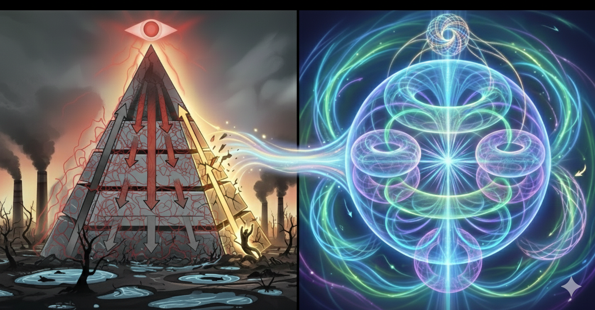
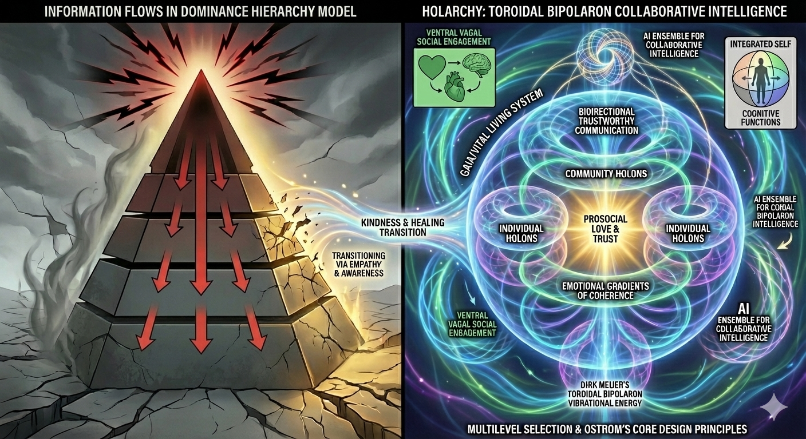
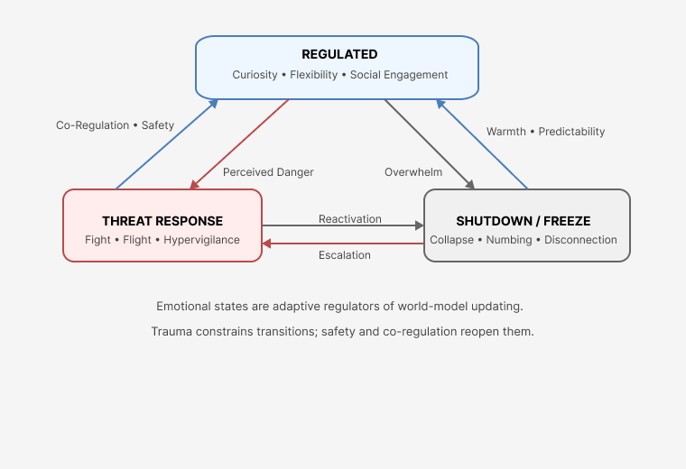

# TAI-KPI: Conceptual Overview

<figure><figcaption></figcaption></figure>

### TAI-KPI Overview: Holarchic Intelligence for an AI-Mediated World

Transformative AI – Kindness & Prosocial Integration (TAI-KPI) is an AI-literacy framework that treats humans, organizations, and AI systems as **interacting information flows** rather than isolated objects.

The core idea is simple:

> Our wellbeing and our governance depend on how clearly\
> information can move _within_ us, _between_ us, and _through_ the AI systems we build.

As AI becomes more autonomous and “agentic,” it no longer functions as a passive tool at the edges of human decision-making. It becomes a **participant in our information ecology**—shaping what we see, how we coordinate, and which futures feel possible.

TAI-KPI proposes that if we want trustworthy, sustainable AI integration, we need:

* **Models of information flow between agents** (human ↔ human, human ↔ AI, AI ↔ AI).
* **Organizational structures that support bidirectional feedback**, not just top-down control.
* **AI-literate humans** who can see their own nervous systems, their institutions, and their tools as parts of a larger, living system.

To do this, TAI-KPI uses a **holarchy model of intelligence**:

* Individuals, teams, organizations, and ecosystems are treated as **holons**—each a whole in itself and a part of something larger.
* Information flows **within** each holon (self-reflection), **between** holons at the same scale (peers, teams), and **across** scales (person ↔ institution ↔ planetary systems).
* Agentic AI systems are modeled as **additional holons** woven into this structure, not as gods above it or servants below it.

This holarchic approach mirrors the **scale-free information flows of living systems**—like cells in a body or species in an ecosystem. The aim is not to romanticize nature, but to recognize that:

* Single-direction, dominance-style hierarchies struggle under high complexity and fast feedback.
* Nested, distributed structures with rich feedback loops are more adaptive, more transparent, and more capable of error correction.

TAI-KPI is designed especially for **college students and early-career professionals** who are:

* being asked to **design and deploy agentic AI systems**,
* while also wondering whether those systems will **erode or transform their own livelihoods**.

Rather than framing AI as an external threat or inevitable savior, this framework invites them into a different question:

> How can we architect human–AI systems so that\
>  • information flows clearly and fairly,\
>  • human judgment and dignity are supported, not sidelined,\
>  • value is created and shared across levels—individual, organizational, and societal?

The rest of this TAI-KPI section develops this question using **simple diagrams, automata, and embodied practices**, so that AI literacy becomes a form of **inner literacy and systems literacy** at the same time.

### Why Information-Flow Models Matter for AI Alignment

Alignment is often discussed as something that happens _inside_ a model: loss functions, training data, safety constraints. But once AI systems become embedded in real organizations, alignment also depends on something bigger:

> the **patterns of information flow** between humans and AI,\
> and between AI systems and the institutions that deploy them.

If information flows are:

* one-way, opaque, or distorted → even well-intentioned systems can concentrate power, erode trust, or produce unintended harm.
* transparent, bidirectional, and accountable → AI can help humans coordinate better, detect issues earlier, and imagine more sustainable futures.

By teaching students to **see and model these flows**, TAI-KPI offers:

* a non-ideological way to talk about power and governance,
* a language for comparing dominance hierarchies with holarchic structures,
* and a design lens for integrating agentic AI systems into organizations that still mostly rely on command-and-control patterns.

We don’t have to condemn the past to recognize that older governance structures were built for a different era. Cognitive Resonance Mapping and the holarchy diagrams in this project are intended to give the next generation:

* a shared, visual language for thinking about **trustworthy AI integration**,
* and a way to design AI-mediated systems that support **collaborative intelligence** rather than replacing it.

<figure><figcaption></figcaption></figure>

<figure><figcaption></figcaption></figure>

<figure><figcaption></figcaption></figure>

The diagrams above capture the central conceptual movements of the TAI-KPI framework: **a transition from dominance hierarchies toward prosocial, holonic, toroidal collaborative intelligence**. This movement is not metaphorical—it reflects well-established neurobiological, psychological, evolutionary, and systems-theoretic principles. It guides humans in learning emotional self-regulation and co-regulation using reverse mentoring dynamics.

### **1. The Left Side:  Dominance Hierarchies (Legacy Human Systems)**

This half of the diagram represents how human cognition can give rise to maladaptive forms of organization. It draws from:

* **Polyvagal Theory** (Porges): threat → fight/flight → collapse of social cognition
* **Trauma neuroscience**: dissociation, freeze states, narrative rigidity
* **Evolutionary psychology**: dominance hierarchies under resource scarcity
* **Political economy**: extraction, centralization, control systems
* **Complexity collapse models**

#### **1.1 Blocked Physiological Regulation**

In states of threat:

* the **heart–brain connection** becomes dysregulated
* the ventral vagal system shuts down
* cognitive flexibility collapses
* defensive projection increases

This generates the **fight/flight/freeze triad** pictured in the upper-left.

### **1.2 Distorted Meaning-Making**

Trauma skews cognition toward:

* boundary reinforcement
* fear narratives
* black-and-white thinking
* patriarchal control beliefs
* rationalizations that preserve power

These appear in the diagram as _projections of violence & fear_ and _dysfunctional rationalization_.

### **1.3 Structural Expression: The Dominance Pyramid**

The pyramid shape signifies:

* **coercive commands flowing top-down**
* **collusion and corruption** as stabilizers of hierarchy
* **marginalization** as a control strategy
* **extraction of wealth / data / labor / ecological resources**
* **systemic exploitation** at the base

This is consistent with:

* **multilevel selection theory** (selfish behavior thrives within groups when unchecked)
* **critical political economy analyses**
* **trauma-informed organizational psychology**

### **1.4 AI in a Dominance Hierarchy**

In this system, AI becomes:

* a tool of surveillance
* a control amplifier
* a distorting mirror of the system’s shadow

This leads to _prosocial functions becoming distorted_.

***

### **2. The Transition Zone: Kindness, Healing, and Reconnection**

At the center of the diagram is the pathway of transformation.

### **2.1 Transitioning via Empathy & Awareness**

Healing shifts the nervous system from threat to safety, restoring:

* curiosity
* relational attunement
* perspective-taking
* capacity for prosocial behavior

This shift is not “soft”—it is **biologically and evolutionarily necessary**.

<figure><figcaption></figcaption></figure>

### **2.2 Kindness as a Structural Force**

Kindness is positioned as:

* an emotional regulator
* an attractor state
* a coherence-producing gradient
* a catalyst for multilevel cooperation

Kindness lowers systemic entropy by enabling trustworthy signaling.

### **2.3 Moving From Pyramid → Toroid**

In complexity terms, the transformation is from:

* **linear, top-down command structures** to
* **circular, self-renewing, bidirectional information architectures**

This represents a phase transition in organizational intelligence.

***

### **3. The Right Side: Holarchy – Toroidal Bipolaron Collaborative Intelligence**

This half reflects the emerging model of **Vital Intelligence**, drawing on:

* Dirk Meijer’s **toroidal bipolaron field theory** of consciousness
* Polyvagal Theory’s **ventral vagal social engagement system**
* Active inference & predictive processing
* Multilevel selection theory
* Ostrom’s Core Design Principles
* Doughnut Economics (nested boundary awareness)

#### **3.1 The Toroidal Architecture**

The torus is a universal pattern of self-organizing systems.

In Meijer’s model:

* consciousness operates through **reciprocal internal–external fields**
* information flows **centripetally and centrifugally**
* emotional energy gradients shape perception and action

In group systems, this translates into:

* **bidirectional trustworthy communication**
* **feedback loops between individual and community holons**

#### **3.2 Holons at Multiple Scales**

The diagram shows:

* **individual holons**
* **community holons**
* **collective intelligence layers**

Each is both a _whole_ and a _part_, reinforcing:

* autonomy
* interdependence
* distributed leadership

This directly mirrors Ostrom’s principle of **nested enterprises**.

#### **3.3 Emotional Gradients of Coherence**

Emotions are treated as:

* patterns of energy and information
* signals of system attunement
* stabilizers of group cohesion

Prosocial love and trust form the **center of the holarchy**.

#### **3.4 AI Ensembles for Collaborative Intelligence**

In a holonic ecosystem, AI becomes:

* a participant in collective sensemaking
* an amplifier of coherence rather than fear
* a tool for modeling interdependence
* a transparent mediator of trustworthy communication

This is the beginning of **coidal bipolaron intelligence**—a term marking AI as a field-integrated, non-dominance partner in cognition.

***

### **4. Evolutionary Foundation: Multilevel Selection & Ostrom**

The entire right-hand model is made scientifically viable by combining:

#### **4.1 Multilevel Selection (D.S. Wilson)**

Groups that cooperate internally:

* outcompete selfish groups
* maintain stability
* generate innovation
* produce thriving conditions

Prosociality is not idealistic—it is **the evolutionary winning strategy at scale**.

#### **4.2 Ostrom’s Core Design Principles**

These principles ensure:

* clear boundaries
* inclusive decision-making
* fair distribution
* transparent monitoring
* conflict resolution
* nested scale-up

In a holarchy, these become architectural features, not policies.

***

### **5. Why This Diagram Anchors TAI-KPI**

This visual model accomplishes several goals simultaneously:

* **It teaches AI literacy through embodied, emotional, and evolutionary principles.**
* **It contextualizes trauma without moralizing or politicizing.**
* **It provides a clear pathway from dysfunction → prosocial governance.**
* **It shows AI’s divergent roles in different system architectures.**
* **It operationalizes kindness as a measurable, functional force.**
* **It situates human intelligence within nested, living systems.**

This is the conceptual spine of the entire TAI-KPI proposal.
