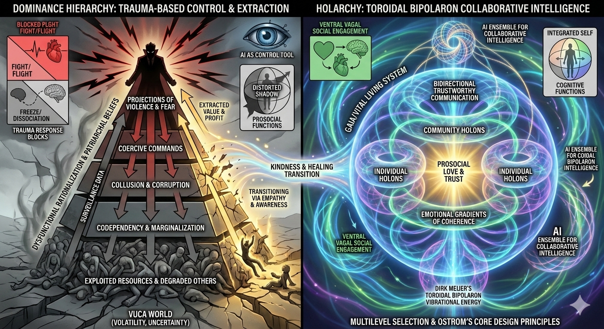

# TAI-KPI Project

<figure><figcaption></figcaption></figure>

### Contents:

### [TAI-KPI Conceptual Overview](./#tai-kpi-conceptual-overview)

### [Pedagogical Framework](./#pedagogical-framework-cognitive-resonance-mapping)  Cognitive Resonance Mapping

### 1. Overview: Humans as Information Systems

### 2. Legend: How to Read the Diagrams

### 3. Phase 1 – Recognizing the Static

#### 3.1 Model 1: The Rigid State Machine

#### 3.2 Reflection & Practice

### 4. Phase 2 – Tuning the Receiver

#### 4.1 Model 2: The Grounded Sensor

#### 4.2 Somatic Practices & Metacognition

### 5. Phase 3 – The Resonant Network

#### 5.1 Model 3: Holarchy & Kindness Protocol

#### 5.2 Group Exercises & Collaboration

### 6. Phase 4 – AI as Cognitive Amplifier

#### 6.1 Model 4: Collapse vs Expansion

#### 6.2 AI Literacy & World-Model Expansion

### 7. Synthesis

#### 7.1 From Dominance to Holarchy

#### 7.2 How This Connects to the Toroidal Overview
