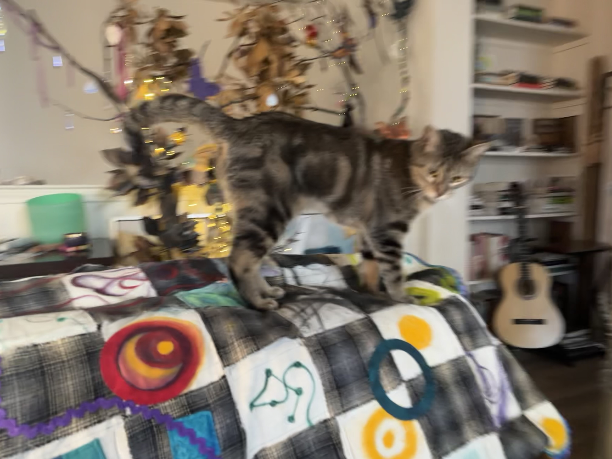
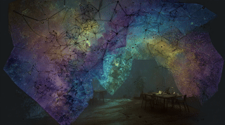

# Creative Artifacts: Images

### **AI Image Generations and Animations**

\
This section collects images and short animations created in Midjourney (with prompts developed through iterative collaboration with Claude and ChatGPT). Some pieces are seeded from real photos reflecting photographic stills of reality as material input, others use images of custom art as style references —used as **creative anchors** and as **privacy-preserving proxies**—to explore speculative, immersive storytelling without relying on direct portraiture.

These artifacts are not “final works.” They are **process evidence**: small experiments that help me build an AI literacy framework grounded in studio practice and computational modeling. You’ll see recurring structures—MPCM (Material → Process → Context → Meaning), Markov models and Markov blankets, and the Bridging Spiral—used as both **conceptual scaffolds** and **symbolic design layers** for prosocial learning.

The goal is simple: **learn by making**. Through iterative creation, reflection, and revision, I’m exploring how attention, emotion, and intention shape decision-making in VUCA environments—using a trauma-informed lens that centers authenticity, kindness, and respect for interdependent living systems.

For comfort and readability, most media is placed in collapsible panels. The piece below is intentionally left visible as a small “curiosity attractor.”

<figure><figcaption></figcaption></figure>

Markov Blankets and Mystical Imaginations

Soph-ai exploring the boundaries of mystical worlds..... on Markov Blanket:  Imaginary boundary exploration  - Midjourney: Animated GIF using Image prompt

<figure><figcaption></figcaption></figure>

Seed prompt with custom art and Sophia

<figure><figcaption></figcaption></figure>

prompt (chatGPT): _A tabby cat sitting at the center of a luminous permeable membrane, woven from raw silk threads and black flannel, the boundary breathing and translucent, signal particles of amber gold and deep blue flowing through it, the cat's eyes reflecting prisms and hanging crystals, dried flowers pressed into epoxy panels on the walls, tree branches decorated with feathers and snake skins and butterfly specimens, warm candlelight and LED fairy lights, chess board geometry underneath organic growth, alchemical symbols painted on silk, the feeling of a curated sanctuary that thinks mixed media collage, Arts and Crafts movement meets quantum physics diagram, warm amber palette, deep indigo shadows, photorealistic with painterly texture_

***

Soph-ai exploring the Markov Blanket information interface  Extended looping animated GIF Custom art - image prompts Custom art - style reference

<figure><figcaption></figcaption></figure>

&#x20;Image Prompts

<figure><figcaption></figcaption></figure> <figure><figcaption></figcaption></figure>

Style Reference Images

<figure><figcaption></figcaption></figure> <figure><figcaption></figcaption></figure> <figure><figcaption></figcaption></figure> <figure><figcaption></figcaption></figure>

Prompt (claude): _Curved studio wall with large-scale projected interactive visualization, warm dark room, toroidal particle fields in amber and blue-steel, DIKW layers visible as color gradients ascending from grey-noise to luminous white, a tabby cat figure sitting before the projection with one hand raised toward the membrane boundary, the figure small against the vast information field, shelves of handmade books and botanical specimens in foreground, long-exposure feel, the boundary between digital projection and physical space dissolving, lighting, alchemical compass rose superimposed faintly, no human forms_

***

Soph-ai exploring simulated predator-prey dynamics -  Exploring the use of Style Reference Images

<figure><figcaption></figcaption></figure>

Style Reference Images

<figure><figcaption></figcaption></figure> <figure><figcaption></figcaption></figure> <figure><figcaption></figcaption></figure>

<figure><figcaption></figcaption></figure> <figure><figcaption></figcaption></figure> <figure><figcaption></figcaption></figure>

_<mark style="color:$primary;">Prompt (Claude): Hand-drawn ecological phase portrait on a chalkboard, predator-prey oscillation curves in white chalk, overlaid with projected digital particle flows from a bioluminescent toroidal simulation, a tabby cat investigating the boundary between analog drawing and digital projection, studio detritus of rulers and colored chalk and handwritten equations, the sense that the drawn curve and the particle field are expressions of the same underlying dynamic, scientific illustration meets contemplative studio practice</mark>_ 

***

Animated Creative Studio - Animated Camera and Silk Interface Layers Custom art used for image prompts  - Animated GIF - Midjourney 

<figure><figcaption></figcaption></figure>

prompt: contemplative future art studio, inspired by the uploaded images and systems diagram, projected markov blanket structures and toroidal DIKW forms illuminating the walls, soft organic architecture, emotionally warm learning environment, analog art tools and digital interfaces coexisting, human intelligence in dialogue with living systems, poetic brain-health studio, cinematic, reflective, immersive, no readable text, no human, animal, or creature forms

Image Prompts: Custom Artwork

<figure><figcaption></figcaption></figure> <figure><figcaption></figcaption></figure> <figure><figcaption></figcaption></figure> <figure><figcaption></figcaption></figure>

Animated Creative Studio - Animated Projected Light Custom art used for image prompts  - Animated GIF - Midjourney 

<figure><figcaption></figcaption></figure>

prompt: contemplative future art studio, inspired by the uploaded images and systems diagram, projected markov blanket structures and toroidal DIKW forms illuminating the walls, soft organic architecture, emotionally warm learning environment, analog art tools and digital interfaces coexisting, human intelligence in dialogue with living systems, poetic brain-health studio, cinematic, reflective, immersive, no readable text, no human, animal, or creature forms

Image Prompts: Custom Artwork

<figure><figcaption></figcaption></figure> <figure><figcaption></figcaption></figure> <figure><figcaption></figcaption></figure> <figure><figcaption></figcaption></figure>

***

Animated Creative Studio - Animated Mirror Objects  - Animated GIF - Midjourney 

<figure><figcaption></figcaption></figure>

prompt: an artist’s studio ‘curiosity habitat’ seen as a still life: woven boundary cloth, branches, snake skin, feathers, prisms casting light, dried flowers, old CDs, maps, punch-card motifs, arranged like an altar to learning, cinematic natural light, no text, no human forms

Animated Creative Studio - Animated camera and light  - Animated GIF - Midjourney 

<figure><figcaption></figcaption></figure>

prompt: an artist’s studio ‘curiosity habitat’ seen as a still life: woven boundary cloth, branches, snake skin, feathers, prisms casting light, dried flowers, old CDs, maps, punch-card motifs, arranged like an altar to learning, cinematic natural light, no text, no human forms

