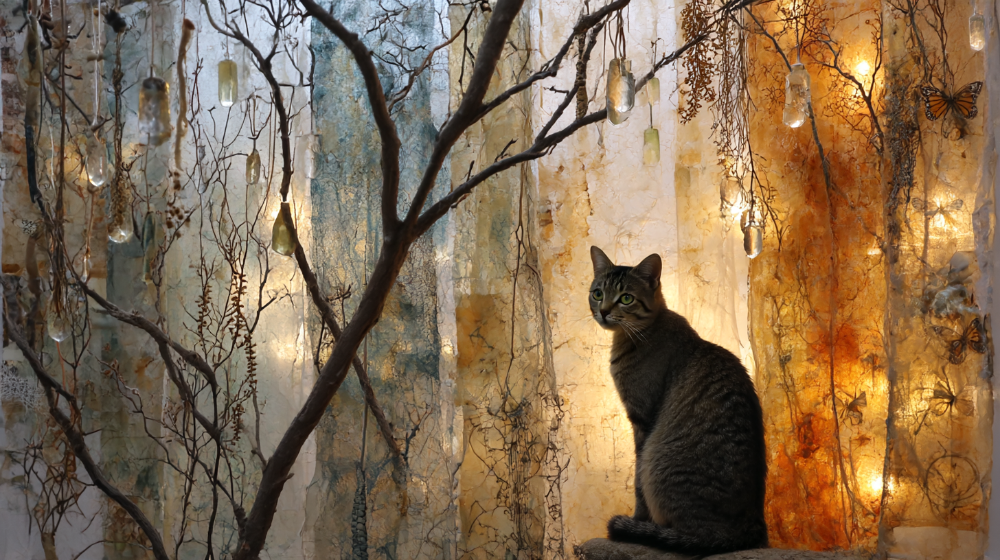
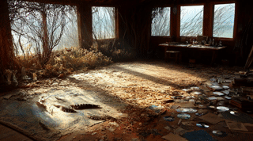

# Creative Artifacts

### **AI Image Generations and Animations**

\
This section collects images and short animations created in Midjourney (with prompts developed through iterative collaboration with Claude and ChatGPT). Some pieces are seeded from real photos—used as **creative anchors** and as **privacy-preserving proxies**—to explore speculative, immersive storytelling without relying on direct portraiture.

These artifacts are not “final works.” They are **process evidence**: small experiments that help me build an AI literacy framework grounded in studio practice and computational modeling. You’ll see recurring structures—MPCM (Material → Process → Context → Meaning), Markov models and Markov blankets, and the Bridging Spiral—used as both **conceptual scaffolds** and **symbolic design layers** for prosocial learning.

The goal is simple: **learn by making**. Through iterative creation, reflection, and revision, I’m exploring how attention, emotion, and intention shape decision-making in VUCA environments—using a trauma-informed lens that centers authenticity, kindness, and respect for interdependent living systems.

For comfort and readability, most media is placed in collapsible panels. The piece below is intentionally left visible as a small “curiosity attractor.”

<figure><figcaption></figcaption></figure>

Markov Blankets and Mystical Imaginations

Sophia the mystical..... on Mystical Markov Blanket: Imaginary boundary exploration  - Animated GIF - Seeded by real image

<figure><figcaption></figcaption></figure>

***

Sophia the mystical..... Imagining flying creatures while on a Markov Blanket - Animated GIF 

<figure><figcaption></figcaption></figure>

***

Sophia the mystical..... on Mystical Markov Blanket: Imaginary boundary exploration  - Animated GIF - Midjourney 

<figure><figcaption></figcaption></figure>

***

Animated Creative Studio  - Animated GIF - Midjourney 

<figure><figcaption></figcaption></figure>

***

Animated Creative Studio  - Animated GIF - Midjourney 

<figure><figcaption></figcaption></figure>

