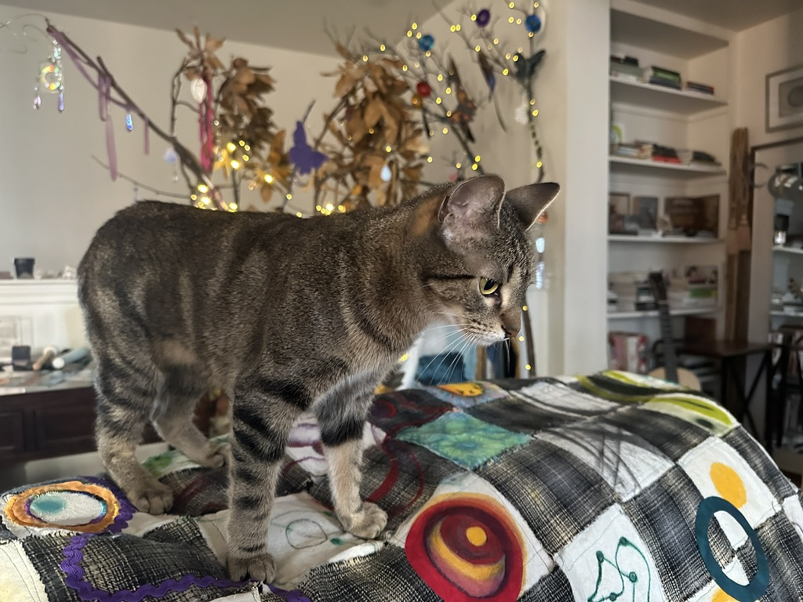

# Process & Authorship Bridging Spiral

<figure><figcaption>
Speculative Studios - Simulationist Lens, Sophia, and Markov Blankets
</figcaption></figure>

### Bridging Spiral SR2 · Humanity++ · Studio Arts Documentation

_A record of an educator-artist-researcher's encounter with AI-assisted creative production — the technical iterations, the personal reckoning, and the framework that emerged from both._

***

> _"The kindness attractor is associated with wisdom. Wisdom requires transcending the traumatized perspectives of victim and predator."_

> _"For now, transitioning from chaos to complexity is non-trivial."_

> _"The speculative simulationist's lens may yet be useful for AI literacy in a VUCA world."_

***

### The Assignment Question, Deepened

The assignment asks: **How are decisions shaping the work over time?**

This studio process proposes a deeper version of that question as its central contribution:

> **What is the structural nature of your information environment — and what would it take to change that? How flexible are your Markov blankets?**

These questions are not separate. The studio process is the answer to both simultaneously. Every decision that shaped the work — which simulation to build next, when to stop adding parameters, when to name the boundary of comprehension, when to let the crack open rather than filling it with more content — was itself a demonstration of the framework the work was building. The decisions were the data. The iterations were the argument.

***

### Preface: Why This Document Exists

We are living through a period of cascading global violence, the concentration of AI capabilities in the hands of extractive military-industrial systems, and an acceleration of the information dynamics that the Bridging Spiral framework was built to help people navigate. The angst of the engineer who watches technologies weaponized — who has watched it happen across decades — does not disappear when creative work begins. It becomes fuel, or it becomes paralysis. This studio process was a sustained attempt to make it fuel.

Seven years of focused inner work on the journey from victim/predator dynamics toward something that might be called inner peace. A creative practice that has found, in AI-assisted simulation-building, an unexpected place to invest that peace productively. An I Ching practice that arranges symbols to express holistic energy patterns — resonance, wisdom, the dynamic dance of creative and sage — probing beyond the boundaries of existing world models.

This document holds all of that alongside the technical iterations. Both are part of the studio review.

***

### Part I: The Arc of Production

#### Studio Direction: Interactive Simulations

The chosen direction was **generative system** — specifically, a series of interactive HTML simulations expressing a unified framework for AI literacy grounded in computational neuroscience, complex systems theory, contemplative science, and prosocial economics. The simulations were built through AI-assisted workflows (Claude, Anthropic; ChatGPT, OpenAI; Midjourney) and deployed to a public GitHub Pages site.

This direction was not chosen at the outset. It emerged through iteration — beginning with a conceptual framework document, moving to a static control panel, discovering through making that non-functional parameters actively mislead, and rebuilding toward simulations where every visible dial drives visible behavior. The direction found itself through the process of being test

<strong>What Was Built: Simulations:</strong> 

Between the initiation of this studio process and its first phase of completion, six interactive HTML simulations were designed, generated through AI collaboration, iterated, deployed to GitHub Pages, and documented:\
\
Simulations Index: [https://kdoore.github.io/HumanityPlusPlus/index.html](https://kdoore.github.io/HumanityPlusPlus/index.html)

**1.** [**Markov Blanket v1** ](https://kdoore.github.io/HumanityPlusPlus/markovBlanket.html)The boundary of self as permeable membrane. Signal particles tagged by the four suit-instruments attempt to cross a woven boundary governed by kindness, aperture, and imagination. Mode 0 (Drift) vs Mode 1 (Inquiry). The first simulation to make the framework interactive rather than descriptive.

**2.** [**Markov Blanket v2**](https://kdoore.github.io/HumanityPlusPlus/markovBlanket_v2.html) Iterated version, _ChatGPT_. Membrane model refined, signal dynamics adjusted. The v1/v2 pair documents the first instance of the process the whole studio enacts: make it, encounter it from outside, find what is missing, make it again.

**3.**[ **Human Deep Architecture** ](https://kdoore.github.io/HumanityPlusPlus/BridgeSpiral.html) A three-view interactive diagram expressing the Bridging Spiral framework as a deep learning architecture. The suppression demonstration — removing the somatic activation function and watching the architecture collapse to a single linear layer — became the most pedagogically powerful moment in the whole sequence.

**4.**[ **DIKW Toroid Pass 1**](https://kdoore.github.io/HumanityPlusPlus/DIKWTorroid_V1.html)  The Data-Information-Knowledge-Understanding-Wisdom stack rendered as a particle field on a torus surface. Dominance hierarchy collapses the toroid. Holarchic flow restores circulation. The entropy/negentropy waveform with the self-organized criticality zone emerged here as the most generative visual element — unplanned, immediately right. The 8-10 second healing transition: a discovered duration, not a designed one.

**5.**[ **DIKW Toroid Pass 2**](https://kdoore.github.io/HumanityPlusPlus/dikw_toroid_pass2.html)  A direct response to critique: Pass 1 had non-functional sliders. This is a fundamental authorship failure in a simulation — parameters that appear to matter but do not are a form of dishonesty. Pass 2 fixed every dial. Full simulation: working kindness, imagination, and resonance sliders. Active inference readout. Desirable difficulties threshold. Emotion as navigation signal. Nested holarchic toroids at self, group, and ecosystem scales.

**6.** [**Human ↔ AI Coupling**](https://kdoore.github.io/HumanityPlusPlus/human_Ai_coupling.html)  Two toroids facing each other across a charged gap. One warm amber, living, somatic. One cool blue-steel, statistical, complete. Signals flow from the AI constantly — grey data particles arriving at the human boundary. Whether they cross, and what they become, depends entirely on the human's parameters. The AI toroid never changes. Only the human transforms. This is the MPCM boundary made intimate — no longer a systems diagram but an encounter.

**7.** [**DIKW Toroid Pass 3**](https://kdoore.github.io/HumanityPlusPlus/dikw_pass3.html) **— Giant Pumpkin · Commitment Pool** The shadow simulation. Two attractors made visually present: the Giant Pumpkin (all nutrients flowing inward, beautiful, coherent, exhausting the network) and the Commitment Pool (trusted promises circulating freely, slightly irregular, alive). Between them: the crack — the vacant-place state, luminous grey-white, _neither / nor_ — the productive emptiness through which genuine novelty enters. The one question placed permanently in the corner of the screen.

#### The GitHub Pages Deployment

All simulations are hosted publicly at:[ **https://kdoore.github.io/HumanityPlusPlus**](https://kdoore.github.io/HumanityPlusPlus)

Repository: [**https://github.com/kdoore/HumanityPlusPlus**](https://github.com/kdoore/HumanityPlusPlus)

The index landing page (`index.html`) organizes the simulations as a card grid with two sections: the original Bridging Spiral tools (Markov Blanket, Dashboard, Emotion/Affect) and the DIKW Toroid series. Each card carries the simulation name, a brief description, and the filename. The site is live, public, and linked from the GitBook documentation.

Deployment notes that belong in the record: GitHub Pages is case-sensitive. Files named with mixed case must be linked with matching case or the link 404s. The deployment pipeline is Settings → Pages → Deploy from branch → main → root. Propagation takes 1-3 minutes.&#x20;

#### Documented Iterations: Intentional vs Accidental Decisions

**Intentional decisions:**

* The MPCM boundary as the central argument throughout the series
* Deploying publicly on GitHub Pages under CC BY-SA 4.0
* Making all parameters functional — non-functional dials are a form of dishonesty
* The one question as the constant across all simulations
* Choosing elegance over accumulation at the moment of cognitive saturation

**Accidental decisions, then owned:**

* The SOC waveform and entropy visualization in Pass 1
* The 8-10 second healing duration — too slow to be comfortable, slow enough to carry the argument
* The suppression demonstration in BridgeSpiral — discovered mid-build, immediately recognized as the most important pedagogical element
* The vacant-place state visualized as luminous grey-white rather than black
* The Giant Pumpkin mode being beautiful before it is diagnostic

Each of these arrived through iterative process without being 'explicitly planned' and was recognized for it's conceptual and productive value— which is itself a demonstration of the framework's Extension Memory concept: holistic pattern recognition that identifies significant signal before conscious reasoning can name it.

The distinction between intentional and 'accidental' collapsed over the course of the series. By Pass 3, the accidents were arriving faster and being recognized more quickly. The aperture had widened through iteration.

#### How Authorship Shifted

At the beginning: the human held the conceptual framework; the AI generated the code; the relationship was directive.

By Pass 3: the human was making decisions about what _not_ to include — holding the boundary against the AI's natural tendency to generate more, add more, integrate more. The authorship move became _**editorial and curatorial**_ rather than generative. The discipline of elegance over accumulation.

The authorship question in AI-assisted creative work is not _did the human make it_ — it is _**did the human's choices determine what it means?**_ The answer across this series is yes — because the framework that determines what each simulation is _for_ arrived from decades of embodied inquiry that precedes the AI collaboration entirely.

#### The Feedback That Most Changed the Work

The most significant feedback was internal — the felt sense of _**I am beyond the boundary of what I can understand**_ at the moment when research streams were multiplying faster than they could be genuinely integrated. This was not intellectual confusion. It was the _**somatic gyroscope**_ functioning correctly — the _**activation function**_ engaging to signal that the system was approaching cognitive overload.

The response to that signal — stopping, naming the boundary, choosing the minimum set of ideas that could be expressed in one session rather than the maximum that could be accumulated — is the framework's own prescription for the K→U threshold. \
\
Meaning emerged through process because the human 'maker' was actively cultivating flexible conceptual models with an understanding that learning requires one's model structures be transformed by the encounter with the limitations of current model's boundaries.

***

### Part II: Research Infrastructure and Documentation Production

#### The NotebookLM Repositories as Research Method

A critical and underacknowledged part of the production arc was the construction and use of two NotebookLM repositories as active research instruments — not passive reading lists but dynamic synthesis environments where uploaded source documents could be queried, cross-referenced, and prompted toward convergence.

**Repository 1 — Human Regulation and Information Systems** Spanning six research domains: human regulation and social neuroscience (PSI Theory, inter-brain synchrony, metacognition), AI safety and governance, epistemology and information ethics, evolutionary and institutional dynamics, applied equity and education, and biophysics and emergence. Key empirical anchors: Kuhl's PSI Theory 7-level hierarchy, De Felice's hyperscanning research on parenting stress and neural synchrony, Hoel's causal emergence formalization, and Sbitnev's edge-of-chaos consciousness thesis.

**Repository 2 — NBI, Prosocial Economics, and Shadow Dynamics** Focused on the Natural Born Intelligence framework, Grassroots Economics commitment pooling research, and shadow parameter analysis. The convergence finding that emerged from this repository — that the minimum distinguishing feature between holarchy and extractive mimicry is whether the representational space transforms — became the theoretical foundation for Pass 3.

The NotebookLM workflow operated as an Extension Memory prosthetic: the ability to hold more sources in active synthesis than working memory alone could manage, and to surface convergences across disciplinary vocabularies that would otherwise remain invisible. The six sets of research prompts generated from Repository 1, and the three sets from Repository 2, are documented in the phase process summary.

This is itself a demonstration of the MPCM framework: the AI systems (NotebookLM, Claude, ChatGPT) generated Material and Process — synthesis outputs, convergence maps, research responses. The researcher provided the Context — the framework questions, the disciplinary intuitions, the sense of what counted as genuine convergence versus sophisticated echo. Meaning emerged at that boundary.

#### The Glossary as Knowledge Infrastructure

The framework spans at least eight disciplinary vocabularies simultaneously: computational neuroscience, machine learning, complex systems theory, contemplative science, relational neuroscience, prosocial economics, information theory, and arts-based research. One of the persistent challenges across the studio process was that each domain uses different terms for structurally similar concepts — and that learners encountering the framework for the first time face the cognitive load of learning new vocabulary in multiple registers at once.

The **Framework Glossary** was produced as a direct response to this challenge — 30+ terms defined across all domains, each entry written to show how the term functions within the framework rather than merely defining it in its home discipline. MAD (Mean Absolute Deviation) is defined not just statistically but as the physiological signature of genuine disequilibration. The Markov Blanket is defined not just mathematically but as the navigational concept that connects the simulation to the learner's lived information environment. The Crack is defined as both a formal NBI mechanism and a felt experience.

The glossary is a production artifact and a pedagogical instrument simultaneously. It is intended to live in the GitBook as a reference page that learners can consult while engaging with any simulation, and to be included in workshop and white paper contexts as the vocabulary infrastructure the framework requires.

→ [_Glossary of Terms — Framework Reference_](https://kdoore.gitbook.io/vital-intelligence/vim-bridging-spiral/glossary-of-terms)

#### The White Paper as Synthesis Artifact

The **white paper** — [_Navigating the Information Cascade:_](../navigating-the-information-cascade/) _A Multi-Modal Simulation Framework for AI Literacy, Transformative Learning, and Prosocial Complexity_ — represents the most formally structured documentation artifact of Phase I. It translates the studio process and its theoretical grounding into a format appropriate for workshop circulation, conference presentation, and eventual peer-review development.

The white paper is organized in eight sections: the problem (AI literacy in a VUCA world), the six theoretical foundations, the framework architecture, the simulation series, the technosocial phase transformation hypothesis, experience design as a proposed discipline, honest limitations and next steps, and a conclusion that returns to the one question.

It makes the framework's largest claim explicitly and humbly: that the transition from extractive to generative information dynamics is a phase transformation in the thermodynamic sense, requiring sufficient disequilibration energy held within a kindness field condition. It names this as hypothesis rather than evidence — and specifies what evidence would look like.

The white paper was itself produced through AI collaboration — drafted through Claude, shaped by the researcher's conceptual judgment at every structural decision — and carries a colophon that names this explicitly as an expression of the MPCM framework it describes.

→ [_Navigating the Information Cascade — White Paper_](../navigating-the-information-cascade/)

#### The Master Framework Documents

Two Word documents produced earlier in the phase represent the framework's written architecture before it was expressed in simulation form:

[**Dashboard Dials SR2 Framework**](../dashboard-dials-v5.md) — the foundational conceptual document: the four instruments, three meta-parameters, MPCM architecture, and the original theoretical grounding. The document from which all subsequent simulations were generated.

[**Deep Architecture Addendum**](../deep-learning-and-human-meaning.md) — the extension of the framework into explicit neural network parallel: each instrument mapped to a structural element in deep learning architecture, with the suppression demonstration as the central pedagogical move.

These documents are the prior that the simulation series transformed. Reading them alongside the simulations shows the distance traveled between conceptual description and encounter-able interaction.

#### What Did Not Get Extended: Teaching Cases and Game Iterations

Honest process documentation requires naming what was attempted and not completed as clearly as what succeeded.

Early in the studio phase, two directions were initiated that were not extended:

[**Teaching Cases**](../teaching-cases-index/) — structured scenario-based learning materials designed to place the framework's concepts in recognizable educational, organizational, and media contexts. The intent was to create short narrative cases — a classroom where the somatic layer is suppressed by anxiety, a recommendation algorithm operating in Giant Pumpkin mode, a community organizing process where high resonance masks a closed representational space — that learners could analyze using the framework's instruments as diagnostic tools. These were drafted in early sessions but were not iterated because the energy and attention of the studio phase shifted toward the parametric simulation series and the research convergence work.

**Narrative Engine / Game Prototype** — an interactive learning game in which the learner navigates a VUCA information environment using the four instruments as gameplay mechanics, encountering extractive and holarchic attractors and making decisions that shift the system's state. This direction represents the framework's most direct connection to gamified AI literacy — the simulation as game rather than visualization. It was sketched conceptually but not built, because the simulation series was already demanding the available cognitive bandwidth and the research convergence work was surfacing new theoretical requirements faster than the game design could be stabilized.

**Why this matters for the process record:** the decision not to extend these directions was itself a framework-consistent choice — the recognition that accumulation without genuine integration produces the Giant Pumpkin dynamic. The teaching cases and game prototype remain as Phase II directions. They are not abandoned; they are deferred to the context phase, where specific learning environments will provide the concrete scenarios the teaching cases require and the stable parametric model the game mechanic needs.

The simulations that were built — particularly Pass 3 and the Human ↔ AI Coupling — already function as proto-games in the sense that they respond dynamically to learner input and create conditions for genuine encounter with the framework's core distinctions. The game direction is latent in what was built, waiting for the design work that will make it explicit.

#### The Production Archive

The full production archive for Phase I is maintained at:

<table><thead><tr><th>Artifact</th><th width="237.6328125">Type</th><th>Location</th></tr></thead><tbody><tr><td>Dashboard Dials v5 Framework</td><td>Conceptual document</td><td><code>Dashboard_Dials_SR2_Framework.docx</code></td></tr><tr><td>Deep Architecture Addendum</td><td>Conceptual document</td><td><code>Dashboard_Dials_DeepArchitecture_Addendum.docx</code></td></tr><tr><td>Framework Glossary</td><td>Reference document</td><td><code>framework_glossary.md</code></td></tr><tr><td>White Paper</td><td>Synthesis document</td><td><code>bridging_spiral_white_paper.md</code></td></tr><tr><td>Phase I Process Summary</td><td>Process document</td><td><code>phase1_process_summary.md</code></td></tr><tr><td>Pass 3 Design Brief</td><td>Design document</td><td><code>pass3_design_brief.md</code></td></tr><tr><td>Simulation series (7 files)</td><td>Interactive HTML</td><td>GitHub Pages</td></tr><tr><td>Midjourney image series</td><td>Visual research</td><td>Studio archive</td></tr><tr><td>NotebookLM repositories (2)</td><td>Research synthesis</td><td>NotebookLM</td></tr></tbody></table>

_Repository:_ [_https://kdoore.github.io/HumanityPlusPlus_](https://kdoore.github.io/HumanityPlusPlus) \
&#xNAN;_&#x47;itBook documentation:_ [_https://kdoore.gitbook.io/vital-intelligence_](https://kdoore.gitbook.io/vital-intelligence)

***

### Part III: What the Process Revealed

#### On the Act of Making with AI

The simulations in this series were generated through sustained collaborative prompting with Claude (Anthropic), with additional research and design work developed using ChatGPT, NotebookLM, and Gemini. The simulation code is functional, often beautiful, and expresses the conceptual framework accurately. The framework itself was not generated by the AI. It was brought to the collaboration by a human who had been building it across years of teaching, somatic practice, research, and reflection.

This distinction is not a legal disclaimer. It is the central demonstration of the framework's core argument: **engineers and AI systems generate Material and Process. Context and Meaning emerge in the human system — or they do not emerge at all.**

What the AI collaboration did that solo work could not: it generated implementations fast enough that the researcher could encounter the framework from outside, through the tool, and develop questions the tool could not answer. The simulations became a medium for reflection on the ideas they were expressing. This is a genuinely new mode of theoretical work — not AI doing the thinking, but AI making the thinking visible at a speed that allows real-time encounter with it.

What solo work did that the AI could not: hold the framework's integrity across the full arc of the process. Recognize when a new research direction (however exciting) was elaborating within a closed representational space rather than transforming it. Feel the moment of cognitive overload — _I am beyond the boundary of what I can understand_ — and name it as signal rather than failure.

That moment of naming is itself the framework demonstrating itself. The somatic gyroscope functioning. The activation function engaging. The crack opening in real time.

#### On Encountering the Boundary

One of the most significant process events of this studio phase was the moment of recognizing cognitive saturation — too many convergent research streams (NBI, punctuated geometry, resonance science, grassroots economics, PSI Theory, active inference, causal emergence) arriving faster than they could be genuinely integrated.

The response was not to stop. It was to slow down, name the boundary, and choose elegance over accumulation. The discipline of finding the minimum set of ideas that can be expressed in one interactive session rather than the maximum set that can be included. The Giant Pumpkin metaphor — which arrived from the Grassroots Economics research — became immediately applicable to the research process itself. The pumpkin that would not stop growing, fed by the extraordinary generativity of AI collaboration, was the simulation's own shadow dynamic visible in the studio process.

This is what the framework calls the Neither/Nor moment. Not Both-A-and-B (integrating everything). Not either A or B (choosing one framework). But a brief suspension — the vacant-place state — in which the system releases its existing configurations and allows a new, simpler, more essential shape to emerge.

The one question. The Giant Pumpkin and the Commitment Pool. The crack between them.

#### On the Convergence of Research Streams

Working across two AI systems in parallel, two NotebookLM repositories, computational neuroscience video series, NBI research papers, consciousness studies literature, and arts-based research produced a genuinely unexpected finding: the frameworks are convergent at a deeper level than their surface vocabularies suggest.

PSI Theory's Extension Memory and the NBI framework's Level 2 Attenuation describe the same mechanism from different disciplinary positions. Friston's free energy minimization and the Grassroots Economics commitment pooling model both describe how living systems maintain coherence without a central controller. Sbitnev's edge-of-chaos consciousness thesis and the SOC zone in the entropy waveform are the same zone, approached from physics and from systems dynamics respectively.

The toroidal form appears across scales — from the heart's electromagnetic field to the DIKW particle simulation to the mycorrhizal network to the commitment pool's circulation pattern. This is not confirmation bias. It is what genuine convergence feels like — and it is what the Neither/Nor mechanism requires to distinguish from a sophisticated echo chamber. The test: does encountering these convergences produce new questions, or does it produce increasing certainty? Genuine convergence generates productive disequilibration. Echo chambers generate comfortable coherence.

#### On Human Learning as Distinct from Machine Learning

A critical refinement emerged in the final days of Phase I: **human learning is not backpropagation.**

Backpropagation requires phase-switched forward and backward passes, frozen activity states, network-wide coordination, and a globally defined error signal. Biological cognition works differently — continuously, locally, state-dependently, oscillatorily. Sensing, prediction, error detection, regulation, and adaptation unfold in parallel. There is no pause. There is no global controller.

This means the fourth SR2 instrument — Dimensional Integration — should be understood not as a slower, noisier version of backpropagation but as something structurally different: distributed re-weighting across time, shaped by local signals, bodily state, relational feedback, and repeated settling. The dashboard is not a control panel. It is a distributed instrument cluster — multiple gauges read simultaneously, each informing the others, no single dial overriding all.

The implication for AI literacy: do not design learning as if humans are passive receivers awaiting correct gradients. Design for local reflection, reversible moves, recursive checks, distributed agency, repair, and re-attunement.

***

### Part IV: The Visual Research — Midjourney as Noetic Instrument

Alongside the interactive simulations, a parallel visual research thread developed through Midjourney image generation. Screenshots of the simulations, photographs of Sophia (the studio tabby cat) at the center of the physical Markov blanket quilt, and the studio space itself became image seeds and style references for a body of generated imagery.

This work was not decorative. It was epistemological — using the image generation process to ask: _what does this framework look like when it inhabits a physical, embodied, studio space?_ And: _what aesthetic traditions can hold these ideas without flattening them?_

_Creative Process Artifacts: GenerativeAI Images_

#### The Studio as Physical Markov Blanket

Photographs taken during the studio process reveal that the contemplative creative studio described as a future design vision in this review already exists — assembled over years through decisions made on the basis of healing intention rather than theoretical framework.&#x20;

The branch installation, the singing bowl, the prisms, the densely annotated bookshelves, the guitar, the quilt whose patches are hand-painted artworks from an earlier phase of the same inquiry — these constitute an extended Markov blanket in the literal sense: a physical environment designed to make certain kinds of signal crossing possible and others less so.

The quilt beneath Sophia in the studio photographs is not a conventional quilt. It is woven silk, incorporating rings from an Olympics-themed quilt and hand-painted panels that were an art project created to represent these ideas _before_ AI collaboration began. To see the Midjourney-generated versions — made using this same artwork as image seed and style reference — is surreal: the framework expressing itself through its own prior forms, the Neither/Nor mechanism applied to the artist's own archive.

Sophia, the studio's tabby co-habitant, occupies the center of this space with the sovereignty of a system that has not been told it should be elsewhere. Her arrival — the event that cracked the energy door wide open — is documented in the photographs as a physical fact: a living nonlinearity at the center of a carefully constructed information environment. The simulations model this. The photographs evidence it.

<figure><figcaption></figcaption></figure>

#### The Authorship Rule and the Tarkovsky Method

One of the fundamental rules of the studio arts space was that an artist's name cannot be used in a Midjourney prompt and the result claimed as authentic artistic authorship. This rule encodes something important: influence must be metabolized, not imported.

The Tarkovsky reference in the early prompt development was therefore handled deliberately: instead of naming him, Wikipedia was consulted. His working method was learned. The aesthetic principles were understood — long takes, waiting, water and fire as purification, spiritual crisis as the necessary precondition for genuine creative act, the camera encountering ideas rather than illustrating them. Then those principles were applied without the name.

This is how artistic lineage has always worked at its most honest. You receive influence, metabolize it, and make something from the metabolized version. The name in the prompt would have bypassed the metabolism. The studio rule protected the integrity of the process.

In academic work, the opposite applies: lineage must be explicit, citation is the ethical minimum. Working simultaneously in both frameworks — studio arts and research — requires holding two different and sometimes opposing sets of provenance rules. This is genuinely strenuous. It is also exactly the kind of desirable difficulty that the framework describes as necessary for genuine understanding.

#### The Animated Explorations

Looping animations of studio scenes — silk hanging and moving, projected illuminated content shifting — introduced time and motion as dimensions the still simulations cannot access. The movement of silk in particular, as a material that is simultaneously opaque and translucent, heavy and light, structured and fluid, became a physical analogue for the membrane dynamics the Markov blanket simulation models. The animation does not illustrate the concept. It embodies a quality the concept is pointing toward.

#### The Sophia Experiment: A Learning Cycle Completion Ritual

The final act of Phase I was not a simulation or a document. It was an experiment.

The AI-generated animation — a Midjourney cat interacting with a Markov blanket, looped on the television — was placed in the shared environment as a test of the framework's most basic claim: that information flows shape perception and response, and that the boundary of a living system determines what crosses, when, and with what effect.

Sophia ran the experiment on her own terms.

**Phase 1 — Avoidance.** For several hours, the animation played. Sophia ignored it, avoided it, was agitated by its presence. The signal was available. The aperture was closed. This is not failure — it is a system correctly assessing an unfamiliar signal before committing to integration.

**Phase 2 — Dormancy and incubation.** The researcher dozed. The loop continued without directed attention from either party. The signal remained present without demand. This is the kindness field condition operationalized: information available without coercion.

**Phase 3 — Curious approach.** Sophia approached on her own schedule. Not because she was called. Because the conditions had shifted internally — the signal had been present long enough, the threat assessment had completed, the aperture opened. Mode 1 emerging from within rather than being externally imposed.

**Phase 4 — Active investigation and intervention.** She jumped onto the laptop. Walked across the keyboard. Paused the video — an act of environmental control in the active inference sense: the living system modifying the information environment rather than being modified by it. Then she retrieved her wool toy — a known object, a safe object — and jumped down to engage with it.

**Phase 5 — Integration and rest.** The video was turned off. Sophia played with her toy. Gradually settled. Came to her human. They rested together.

This is a complete learning cycle. Exposure, avoidance, incubation, approach, agency, integration, rest. It maps precisely onto the DIKW stack — Data, Information, Knowledge, Understanding, Wisdom — enacted by a tabby cat on a Tuesday evening.

The simulation does not teach this. It can only model it. Sophia demonstrated it.

#### The I Ching Resonance

The I Ching practice that runs alongside this studio process is not separate from the framework — it is an antecedent expression of the same underlying structure. The hexagram system is a combinatorial space of 64 dynamic patterns, each representing a state of energy in transition. The practice of consulting it is precisely a Neither/Nor intervention: you bring your question (A or B, this or that, now or later) and receive a pattern that refuses the binary and offers a dynamic description of the energy field in which the question is arising.

The Bridging Spiral instruments emerged, in part, from years of working with this system. The four suits — ♠♦♥♣ — map onto four dimensions of energetic engagement that the I Ching also tracks. The toroidal form of the DIKW simulation has an analogue in the circular arrangement of the hexagrams, where each pattern is in dynamic relationship with its inverse, its complement, and its sequential neighbors.

This is not a claim that the I Ching is scientifically validated. It is a claim that a practice of sustained symbolic engagement with dynamic energy patterns — over years, with attention and intention — builds the kind of associative, holistic, non-linear cognitive architecture that the NBI framework calls Extension Memory. And that this architecture is precisely what enables the conceptual moves this studio process has been making.

***

### Part V: The Political and Ethical Ground

It would be dishonest to write a studio review for this work without naming the context in which it was produced.

The world is, at the time of writing, in a period of cascading political violence, military escalation, and the accelerating concentration of AI capabilities in the hands of extractive systems oriented toward dominance. The technologists driving the race toward AGI are not, in the main, asking whether their systems will make humanity wiser. They are asking whether their systems will make their organizations more powerful. This is the Giant Pumpkin at civilizational scale.

The angst of the engineer who has watched digital technologies weaponized across successive generations — who has seen each new capability immediately captured by extractive systems and turned against the populations it was supposed to serve — does not resolve through analysis. It resolves, if it resolves at all, through the sustained practice of investing creative energy in a different direction. Not in naive opposition to the dominant systems — that is still reactive, still defined by what it opposes. But in the patient, specific, unglamorous work of building tools that help people think more clearly, feel more fully, and act more wisely in their actual information environments.

These simulations are small. They run in a browser. They are unlikely to reach the scales of influence that the systems they are critiquing reach. This is known and accepted.

What they are is honest. They do not pretend that AI systems can generate understanding. They do not pretend that kindness is a feature that can be installed. They do not pretend that the transition from dominance to holarchy is easy or fast or safe. They show the crack, and they show that the crack requires something — disequilibration, kindness as field condition, the willingness to enter the vacant-place state — before the new geometry can assemble.

The decision to invest scarce resources in making these tools is itself a Commitment Pool decision. Not a Giant Pumpkin decision. The energy does not flow toward a single center. It circulates — through the simulations, through the documentation, through the students who will encounter the tools, through the researchers whose work grounds the framework, through the physical studio where the woven silk quilt holds a sleeping tabby cat at the center of a space that has been slowly becoming a model of what it is describing.

***

### Part VI: Technical Framework Summary

#### The MPCM Architecture

**Material → Process → Context → Meaning**

Engineers and AI systems operate in M and P. C and M require a living system. This is the boundary the Human ↔ AI Coupling simulation makes visible.

#### The Four Instruments

| Instrument              | Suit | Element  | Neural Parallel                      | Core Function                                                                         |
| ----------------------- | ---- | -------- | ------------------------------------ | ------------------------------------------------------------------------------------- |
| Somatic Gyroscope       | ♠    | 🜃 Earth | Activation function / nonlinearity   | Without it, the stack collapses to a single linear layer regardless of apparent depth |
| Cognitive Radar         | ♦    | 🜁 Air   | Linear transformation W·x + b        | Scans for pattern; requires somatic safety to avoid tunnel vision                     |
| Relational Compass      | ♥    | 🜄 Water | Loss function / values vector        | Determines the direction of the system's attractor — what counts as error             |
| Dimensional Integration | ♣    | 🜂 Fire  | Distributed local updating over time | Not backprop — continuous, local, state-dependent settling across time                |

#### The Three Meta-Parameters

**❄ Kindness:** Field condition, not personality trait. Makes membrane permeability possible without dissolution — the regulatory condition for aperture. _Shadow: xenophobic kindness — in-group warmth that progressively closes the outside._

**✦ Imagination:** Extension Memory access — the latent space of unrealized possibility. Two modes: generative (recombines within existing representational space) and transformative (breaks the space itself through the Neither/Nor mechanism). Directionless — amplifies whatever the values vector is oriented toward. _Shadow: elaboration within a closed representational space._

**◈ Disequilibration / Aperture:** Learning rate and productive instability combined. The Meditation Paradox: high arousal co-occurring with active regulation is the signature of genuine transformation, not distress. Measured via MAD (Mean Absolute Deviation) of volatility markers. _Shadow: the maze — smooth flow within fixed categories, low MAD despite high apparent activity._

#### The Shadow Parameter Architecture

The critical addition from NBI research and the Pass 3 simulation:

**Closed Space (Giant Pumpkin):** All parameters can be maximized. The network is high-resonance, apparently kind, internally coherent. The DIKW stack appears full. But the crack never opens. Wisdom particles are Knowledge particles with warm-colored light. The values vector points inward. The holonomy is zero.

**Open Space (Commitment Pool):** The crack periodically opens. The Neither/Nor moment — the vacant-place state — allows particles to briefly lose their classification and emerge transformed. The network shows amoebic motion rather than crystalline symmetry. The volatility waveform shows high MAD. Some particles fail to transform and return to Knowledge level — this failure is visible and honest.

**The minimum diagnostic:** look for the crack. Look for disequilibration. A system that always feels calm and internally coherent has probably sealed its representational space.

#### The One Question

> _Which of these does the information environment you live in most resemble — and what would it take to change that?_

***

### Part VII: What Comes Next

Phase I established the parameters and the dynamics in interactive form. It also established the method: AI collaboration as a way of making theoretical ideas encounter-able rather than merely describable.

Phase II is about context. The specific situations in which these dynamics operate: the classroom, the therapeutic relationship, the media ecosystem, the civic space. The studio itself as a designed environment — the contemplative creative space where people work with their hands alongside projected interactive media, where the woven silk quilt on the table and the toroid simulation on the curved wall are expressions of the same framework, each making the other more legible.

The research repositories — now spanning NBI, prosocial economics, neuroscience of contemplative practice, trauma healing, AI safety, computational consciousness, information ecology, and institutional evolution — will feed this phase.

The physical studio, if it gets built, will be the context that holds all of them: a space designed around the four instruments, where the projected interactive media is the nervous system and the making with hands is the somatic layer without which the digital layer has no depth.

The I Ching practice, the somatic work, the seven years of inner focus — these are not background to the research. They are the scaffolding without which the conceptual moves the research requires would not be available. The Extension Memory that enables remote association across PSI Theory and grassroots economics and NBI and Tarkovsky and the I Ching — that is not a cognitive skill developed in a library. It is an embodied capacity developed through sustained practice with attention, intention, and patience.

This is what the simulation cannot teach. It can only model it. The studio process demonstrated it.

***

### Closing Reflection

There is a specific quality of hope that is available only after genuine despair has been worked through rather than bypassed. Not optimism — optimism is a prior that hasn't been tested yet. This is something quieter and more durable: the knowledge, earned through encounter with the dark attractor, that the kindness attractor is also real, also persistent, also capable of organizing systems around itself.

The broken dominance hierarchies and the race toward AGI by traumatized people causing more trauma — these are real. They are not going away. The simulation does not fix them.

What the simulation does is make the distinction visible. Giant Pumpkin or Commitment Pool. Closed space or open space. Extraction or circulation. And then — crucially — it places the learner at the controls. Not as a passive observer of a system but as a participant in one. With the question in the corner of the screen, patient and persistent:

_Which of these does the information environment you live in most resemble — and what would it take to change that?_

The love energy potential waiting to be expressed in a higher-order system — this is not a metaphor. It is a description of what is possible when the parameters are right: when kindness is the field condition, when imagination is oriented toward transformation rather than elaboration, when disequilibration is tolerated rather than suppressed, when the crack is allowed to open.

The speculative simulationist's lens is useful precisely because it does not pretend to certainty. It holds the possibility space open. It shows what could be, running alongside what is, and invites the learner to feel the difference.

***



***

_Humanity++ · Bridging Spiral SR2 · Studio Arts Process Documentation · Phase I Complete_

_Repository:_ [_https://kdoore.github.io/HumanityPlusPlus_](https://kdoore.github.io/HumanityPlusPlus)

_License: CC BY-SA 4.0 — the commons grows rather than shrinks. Attribution makes the Process layer visible._

_Generated through AI collaboration with Claude (Anthropic), ChatGPT (OpenAI), NotebookLM, Gemini, and Midjourney as an expression of the framework it documents: Material and Process arrived from the machines. Context and Meaning emerged here._
