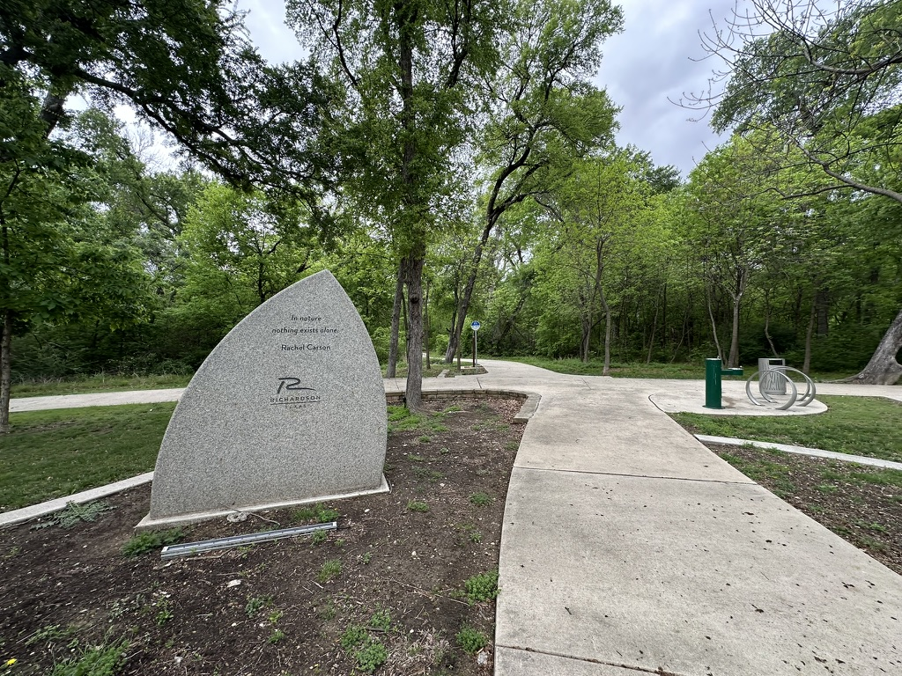

# Humanity as Hyperobject

> _<mark style="color:green;">**In nature, nothing exists alone. — Rachel Carson**</mark>_

<figure><figcaption>
G<em>ranite Marker, Spring Creek Nature Preserve, Richardson, Texas. Photograph by Karen Doore</em>
</figcaption></figure>

***

### The World This Week

_Tier 4 — Researcher Positionality_

***

#### What orbits us

Above the atmosphere, approximately 30,000 human-made objects are in orbit around Earth right now. Roughly 19,000 are trackable debris — defunct satellites, spent rocket stages, fragments from collisions, the accumulated residue of seventy years of decisions made in isolation from one another. Each one was someone's strategic asset. Someone's commodity resource. Someone's gesture of technological ambition.

Collectively, they are a threat to the very future they were meant to enable.

A single high-velocity collision generates thousands of new fragments, each capable of triggering further collisions — a cascade that could render low Earth orbit permanently unusable. Every satellite. Every communications network. Every weather system. Every GPS signal that guides a humanitarian supply route.

Gone. Not because anyone chose catastrophe. Because the accumulation logic — each actor optimizing for their own position, without shared governance — produces catastrophe as an emergent property.

NASA visualizes this field in real time. The image is worth encountering: thousands of points of light in orbital shells around a small blue planet, each point a decision, the pattern emergent.



_<mark style="color:red;">**There is a story about this field that does not resolve neatly.**</mark>_

A satellite was on a trajectory that risked collision with another. A message was sent — the orbital equivalent of a note in a bottle, addressed across geopolitical enmity. There was no formal response. The trajectory changed.

We cannot know exactly why. Perhaps the physics aligned independently. Perhaps someone read the message and acted without acknowledgment. The small act matters without confirmation. **In nature, nothing exists alone** — including gestures made in shared orbital commons under the pressure of physics that does not care about flags.

***

#### What the far side showed us

On April 6, 2026, four human beings flew around the far side of the Moon.

For forty minutes, they were entirely unreachable. No signal. Physics was the only governance. They were on the side of the Moon that no one on Earth can see from any ground, ever, without going there.

They brought back photographs.

In one image, Earth is setting behind the lunar horizon — a crescent, lit on one side, disappearing. Australia and Oceania visible in the light. Everything else in shadow. In the foreground: Ohm crater, its terraced edges formed when the surface rebounded upward from the force of impact. The central peak that forms in the moment of recovery.

_\[Image: NASA Artemis II — Earthset from the lunar far side, April 6, 2026. Credit: NASA / Artemis II crew. Source:_ [_nasa.gov/gallery/lunar-flyby_](https://www.nasa.gov/gallery/lunar-flyby/)_]_

<figure><figcaption>
Earthset from the lunar far side, April 6, 2026, NASA / Artemis II Crew: <a href="https://www.nasa.gov/gallery/lunar-flyby/">https://www.nasa.gov/gallery/lunar-flyby/</a>
</figcaption></figure>

The dark side of the Moon carries two registers in this framework, and I am naming both rather than resolving them.

<mark style="color:$primary;">**The first: the territory beyond the MPCM boundary**</mark> — where AI systems reliably stop and human embodied intelligence becomes irreplaceable. _<mark style="color:$primary;">**You can model the far side mathematically. You cannot see it from Earth regardless of instrument power. That is not a limitation of the tool. It is a structural feature of the system.**</mark>_

<mark style="color:$primary;">**The second: the S2 Vacant Place**</mark> — the neither/nor, the not-yet. _<mark style="color:$primary;">**The far side is not empty. It holds billions of years of geological record, accumulated without a single human witness. The Vacant Place is not absence. It is presence we have not yet learned to encounter.**</mark>_

From the far side, looking back: the orbital debris field is visible as a thin luminous shell around the small blue planet. Humanity's reach. Humanity's residue. Both, simultaneously, unresolvable.

_<mark style="color:red;">**In nature, nothing exists alone.**</mark>_

***

#### What was named at the tomb

The same week, the first US-born Pope held a peace vigil at the tomb of St. Peter and addressed world leaders who choose war.

He named a structural condition: _<mark style="color:red;">**the delusion of omnipotence**</mark>_ — the attractor that mistakes amplification for strength, that accumulates force as if force were wisdom.

_<mark style="color:red;">**He said: sit at the table of dialogue. Not the other table.**</mark>_

This framework uses different language for the same observation. _<mark style="color:orange;">**The extractive attractor.**</mark>_ The accumulation dynamic. The values vector misaligned — not through malice, but through selection pressures that reward scale and filter out care.

A candle at St. Peter's tomb is a small act. A vigil with parishes on every continent, in the same week four humans flew around the far side of the Moon, is a field condition. The question this framework asks of every act: <mark style="color:red;">**does this open movement, or close it?**</mark>

***

#### What the ground held

_Tier 4 — Researcher Positionality_

In 2003, I was standing on the grounds of what became a sacred space and place for my family. \
Someone I love was nearby.

The Space Shuttle Columbia disintegrated on reentry over Texas.

We felt it before we understood it. The earth moved. Then silence. Then the question with no clean symbolic answer:

_How do you explain this to a child?_

Not the mechanics. The _why_ of accumulated decisions that produce catastrophe as an emergent property.

You cannot answer this adequately in language to a nervous system that has just felt the ground shake. What you can do is hold the field. Stay regulated. Not explain. Hold.

This framework is built around that holding.

***

#### What Mary Ann knew

My mother's name was Mary Ann. MAP. She was my map.

She was diagnosed with cancer and given a horizon. She knew. With that knowledge, she gathered her family and took us to see Cirque du Soleil.

She was showing us: _this is what the body can do. In life we have an opportunity to dance, and then we die._

She died within the year. Christmas Eve. Oregon, in a blizzard. She loved snow.

She taught me to be a dancing gyroscope — stable on the z-axis, turning through every condition. _<mark style="color:red;">**This too shall pass**</mark>_ is not resignation. It is the somatic instrument speaking: _<mark style="color:$primary;">**the storm is not the permanent state.**</mark>_

_<mark style="color:blue;">**She left a trace. So did four astronauts on the far side of the Moon. So does every act of creative practice oriented toward the wellbeing of living systems.**</mark>_ So does a granite marker in a park in Richardson, Texas, photographed in all seasons, as a practice of return.

_<mark style="color:green;">**In nature, nothing exists alone.**</mark>_

***

_**What Has Emerged:**_  \
\
_\[Animated images: figure turning, arms open, full-spectrum cape dissolving at the edges into particles of light. From recycled fragments, assembled with care, released into motion._ \
_Inspired by Leanne Doore's Trashion 2026 Garment.]_



<figure><figcaption></figcaption></figure>



***

| Claim                                                            | Tier   | Confidence                                                       |
| ---------------------------------------------------------------- | ------ | ---------------------------------------------------------------- |
| \~30,000 human-made objects in Earth orbit, \~19,000 debris      | Tier 1 | High                                                             |
| Kessler cascade as structural risk of uncoordinated accumulation | Tier 1 | High                                                             |
| Satellite trajectory modification story                          | Tier 3 | Low — structural dynamic confirmed, specific incident unverified |
| Dark side of Moon as MPCM boundary / S2 double register          | Tier 2 | High — internal framework consistency                            |
| Researcher positionality: Columbia, Mary Ann                     | Tier 4 | N/A — lived experience                                           |
| Kindness as field condition operating at scale                   | Tier 2 | Theoretically coherent; empirically emerging                     |
