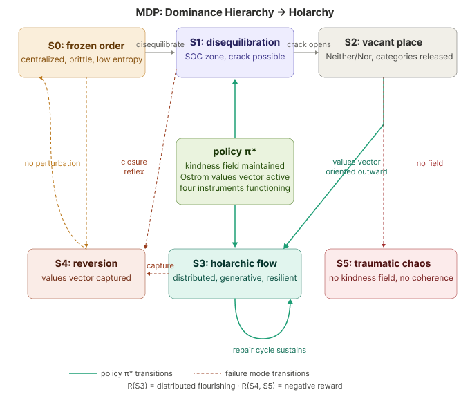

# Modeling Holarchic Transformations

<figure><figcaption></figcaption></figure>

### Modeling the Transformative Learning Paradigm Shift

The paradigm shift is a Markov Decision Process where the current policy — dominance hierarchy — is being forced into a state where its own reward function is failing. The sage-on-stage loses authority not through revolution but through information asymmetry collapse. When learners can query an AI and get a credible counter-argument to a professor's claim in real time, the epistemic monopoly that justified the hierarchy dissolves. The hierarchy's response — doubling down on credentials, suppressing questioning, administrative entrenchment — is the frozen ordered phase trying to maintain coherence by increasing rigidity. It accelerates the failure.

***

### Markov Decision Process: Dominance Hierarchy → Holarchic Flow

**The MDP has six states.**

The optimal policy π\* — kindness field maintained, Ostrom values vector active, four instruments functioning — routes the system from frozen order through productive disequilibration and the vacant-place state into holarchic flow.

**Three failure transitions exist:** the closure reflex returns disequilibration to S4 reversion; values vector capture converts S3 back to S0 frozen order; no kindness field at the crack sends the system into S5 traumatic chaos.

**The S3 maintenance loop is the repair cycle** — the only attractor that sustains itself without external forcing.

***

### The Six States and Their Transitions

_Each state includes a framework description, a poetical rendering of its felt sense, a Midjourney-generated image, and the prompt used to generate it. The images use a consistent visual grammar — bioluminescent, dark-field, botanical material, no human figures — so the series reads as a continuous argument before it reads as a set of labeled concepts. The seed `040126` preserves visual continuity across all images._

_The diagnostic question for each image: does it produce a felt sense before a named concept? If the viewer identifies the state immediately and intellectually, the image is too resolved._

***

#### S0 — Frozen Order ♠

_The attractor that captures without moving_

Every spin aligned.\
The field hums with a single frequency — coherence mistaken for health,\
stillness mistaken for peace.\
No gradient.\
No surprise.\
The network dreams of permanence and calls it order.

<figure><figcaption></figcaption></figure>

> **Prompt used:** _Aerial view of a crystalline lattice structure, all nodes perfectly aligned in amber and gold, rigid geometric symmetry extending to every horizon, no variation, no gradient, a single dominant frequency vibrating through the entire network, cold light from directly above, long shadows, the beauty of total coherence before its fragility is revealed, no organic forms, no living systems, pure crystallography, macro photography aesthetic, extreme depth of field, muted amber palette with deep shadow, 8k_

***

#### T01 — The First Crack

_The perturbation: almost imperceptible_

The fracture is the only asymmetry in the field.\
Everything else remains in perfect order.\
No light enters yet.\
Only the faint wrongness of a thing that cannot be unstarted.

<figure><figcaption></figcaption></figure>

> **Prompt to run in Midjourney:**
>
> ```
> crystalline botanical Penrose tiling with a single hairline fracture beginning at one edge, no light through it yet, fracture is the only asymmetry in the field, everything else in perfect order, neon green trace intensifying at fracture boundary only, cold blue-white ground, left two-thirds intact for text overlay, dark margins, no human elements --ar 16:9 --style raw --stylize 70 --seed 040126
> ```

***

#### S1 — Productive Disequilibration ♦

_The crack that lets the water breathe_

A single node receives what the field did not predict.\
The prediction error propagates — not a disaster, a crack in the ice\
that lets the water breathe.\
Temperature rises.\
Domains of all sizes begin to coexist.\
The lattice does not know what it is becoming.

<figure><figcaption></figcaption></figure>

> **Prompt to run in Midjourney:**
>
> ```
> macro close-up of crystalline Penrose tiling cracking at one corner, amber bioluminescent warmth entering through fracture line, neon green intensifying at crack boundary, translucent cicada wing cases emerging at fracture edge, warm amber bleeding into cold blue-white ice matrix, wide panoramic fracture propagating rightward across lower third of frame, left third still intact and cold, no human elements --ar 16:9 --style raw --stylize 100 --seed 040126
> ```

***

#### T13:  S1 → S2 — The Cascade

_Information propagating outward: the avalanche of lowered thresholds_

<figure><figcaption></figcaption></figure>

> **Prompt used:** _Bioluminescent mycorrhizal network underground, a cascade of light propagating outward from a single nucleation site, nodes of all sizes activating in sequence from center to periphery, the network at the edge of chaos, domains of ordered light and ordered shadow coexisting without resolution, pulse of activation moving like a wave through deep soil, the topology is scale-free — large hubs and small nodes equally visible, no human forms, no animals, only the network itself, dark field microscopy aesthetic, teal and violet palette, the avalanche of kindness as pure physics, 8k_

***

#### S2 — Vacant Place ♠♦

_Neither the old symmetry nor the new_

Neither the old symmetry nor the new.\
The network holds the space between what it was\
and what it does not yet know how to be.\
This is the moment the field is most necessary and most absent.\
The conditioning signal is a direction, not a destination:\
&#xNAN;_&#x6F;utward._\
&#xNAN;_&#x74;oward the commons._\
&#xNAN;_&#x74;oward the edge._

<figure><figcaption></figcaption></figure>

> **Prompt used:** _Moment of phase transition in a magnetic domain lattice, spin domains of all sizes coexisting simultaneously, a luminous grey-white bloom spreading from a single defect point, the geometry of the space visibly transforming around the bloom, warm amber domains and cool teal domains interpenetrating at the boundary, holonomy visible as a subtle angular mismatch in the field lines, no symmetry, pure productive uncertainty, electron microscopy aesthetic meets abstract topology, the crack as a source of light not damage, 8k_

***

#### T23 — Nucleation

_The first node that settles without announcing it_

The first node to settle into a new configuration does not announce it.\
It simply becomes slightly easier for its neighbors to do the same.\
This is not transmission.\
This is the change in the energy landscape that makes the next change\
less costly.\
Cascade begins not with a message but with a lowered threshold.

<figure><figcaption></figcaption></figure>

> **Prompt to run in Midjourney:**
>
> ```
> wide luminous grey-white space, suspended botanical elements distributed across frame, a cluster of three elements at center-right with first bioluminescent green threads forming between them, left two-thirds of frame open and unorganized for text overlay, rest of elements still unconnected, the first coherence event in a vast field, no human elements --ar 16:9 --style raw --stylize 80 --seed 040126
> ```

***

#### S3 — Holarchic Flow ♥♣

_The only attractor that sustains itself_

The network moves the way a mycelium moves —\
no center commanding, no edge forgotten.\
Each node complete.\
Each node partial.\
The wholeness is in the motion, not the map.\
The repair cycle turns.\
The spiral does not end.\
The next level is already forming in the pattern of the last.

<figure><figcaption></figcaption></figure>

> **Prompt used:** _Aerial view of a living watershed, rivers branching and rejoining, each tributary simultaneously whole and part of a larger whole, nutrient flow visible as bioluminescent threads in the water, no central node, no hierarchy of importance, every branch receiving and giving equally, satellite photography aesthetic, deep green and teal palette, golden hour light hitting the water at low angle, no roads, no structures, no signs of human presence, 8k_

***

#### T34 — Reversion Begins ♣

_The grid descends: the capture before it looks like pathology_

<figure><figcaption></figcaption></figure>

> **Prompt used:** _Time-lapse of nutrient flow in a network being captured — all paths gradually redirecting toward a single massive central node, the periphery dimming as the center brightens, the topology collapsing from distributed to radial, a Giant Pumpkin at astronomical scale consuming its own network, the beauty of the capture made visible — it looks like health before it looks like pathology, amber and gold at the center, grey and fading blue at the edges, network topology visualization meets organic biology, no human forms, pure information ecology, 8k_

***

#### S4 — Reversion ♦♠

_The pullback attractor: zero holonomy_

The tightening before you can name it.\
The grid re-imposed over the web.\
Something closing that was open.\
The creeping sense that the frame has shifted\
and it happened while you were looking elsewhere.\
Energy expended. No net transformation.\
The S3 form — with S0's logic operating beneath.

<figure><figcaption></figcaption></figure>

> **Prompt to run in Midjourney:**
>
> ```
> wide view of bioluminescent mycelial network beneath overlaid rectangular graphite grid extending across full frame, network still luminous through the grid, neon green dimming at grid intersections, amber nodes shifting to ochre, left third of frame where grid is denser and network more suppressed for text overlay, some network still glowing beyond right frame edge, grid lines converging, melancholy, no human elements --ar 16:9 --style raw --stylize 100 --seed 040126
> ```

***

#### S3 — Repair Cycle ♣

_Dimensional Integration: the quasicrystal_

<figure><figcaption></figcaption></figure>

> **Prompt used:** _Cross-section of a quasi-crystal growing at the atomic scale, five-fold symmetry that classical crystallography said was impossible, the structure assembling from productive uncertainty — neither conventional crystal nor amorphous material, a third thing forming at the boundary between known and unknown, electron diffraction pattern visible as a ghost overlay, the spiral of integration: action leaving a trace, the trace becoming structure, the structure enabling the next action, no humans, no tools, only the mathematics of the material itself, transmission electron microscopy aesthetic, blue-violet palette, the wisdom structure as pure physics, 8k_

***

#### S5 — Traumatic Chaos ♠♥♦♣

_Markov blanket collapse: the absence of ground_

Not the vacant place — S2 was structured openness,\
luminous and generative.\
This is different.\
Language fragments here rather than fails.\
The body before the mind's eye.\
No kindness field. No organizing principle.\
The violence is over — or has been so total\
that drama is no longer available.\
What remains is aftermath.\
Exhaustion. Not event.

<figure><figcaption></figcaption></figure>

> **Prompt to run in Midjourney:**
>
> ```
> botanical materials bleached and burned scattered across wide frame without coherence or organization, flat diffuse light across dark ground, near-monochrome desaturated palette no bioluminescence no green no warmth, left third of frame where dissolution is most complete and sparse for text overlay, some intact specimens isolated at right, the space between is absence not ground, quality of aftermath, exhaustion not violence, no human elements --ar 16:9 --style raw --stylize 40 --seed 040126
> ```

> **Note on S5:** This state is included for completeness and for the learner who needs to see their experience named. The image is intentionally restrained — no spectacle, no drama. If generating this image produces something visually exciting, revise toward depletion. The kindness field includes the decision about when and whether to show this image in a teaching context.

***

### Reading the Series Together

The series can be read in two directions.

**Forward (S0 → S3):** The generative pathway. Frozen order cracks, cascades through productive disequilibration and the vacant place, nucleates into holarchic flow, and maintains itself through the repair cycle. This is the direction of transformative learning when the kindness field holds.

**Backward and sideways (S4, S5):** The failure transitions. Reversion is not collapse — it is the quiet recapture of the living network by an imposed order. Traumatic chaos is what happens when the crack opens with no field to hold it. Both are real. Both are navigable from — but not through framework alone.

The instruments exist because navigation under these conditions requires more than a map. It requires a calibrated compass, a functioning gyroscope, a cognitive radar scanning for signal, and the integration capacity to hold what has been learned across all of it.

_The one question that orients all six states:_\
**Does this open movement, or close it?**

***

_Full instrument specification: Dashboard Dials v6.1_\
&#xNAN;_&#x4D;DP State Reference (photo categorization guide): \[link]_\
&#xNAN;_&#x56;IM Consciousness Field Simulator:_ [_interactive simulation_](https://claude.ai/public/artifacts/0499102b-6fbf-4e6b-9c9f-e64e15e38e1c)

***

_Image series generated with Midjourney seed 040126. Prompts are part of the open framework documentation._\
&#xNAN;_&#x48;umanity++ | CC BY-SA 4.0_\
\*Repository: [https://kdoore.github.io/HumanityPlusPlus\*\\](https://kdoore.github.io/HumanityPlusPlus*/) \*GitBook: [https://kdoore.gitbook.io/vital-intelligence\*\\](https://kdoore.gitbook.io/vital-intelligence*/) _Draft: April 2026 — SR3 Section_

