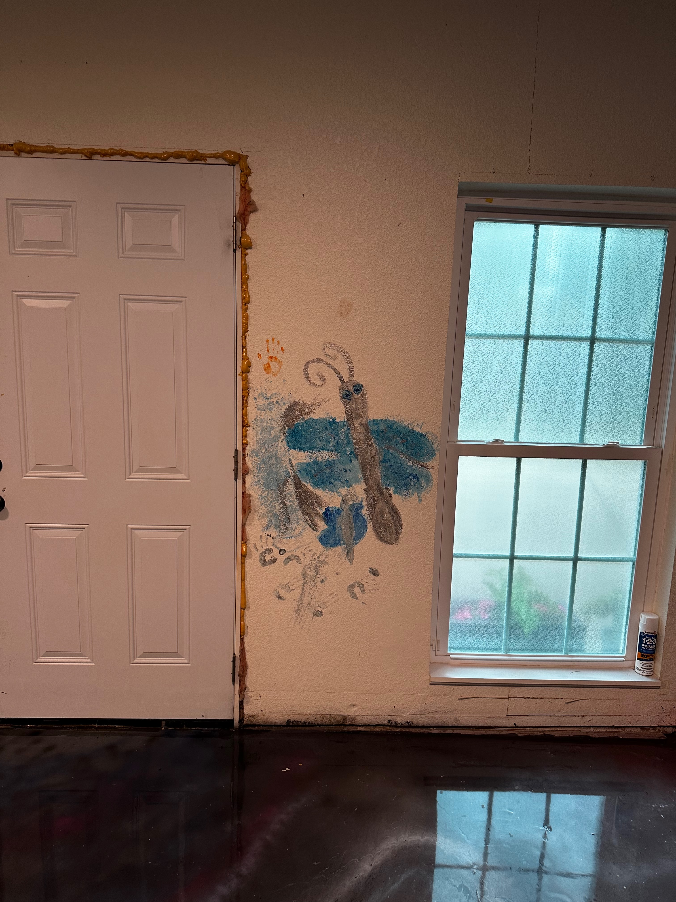
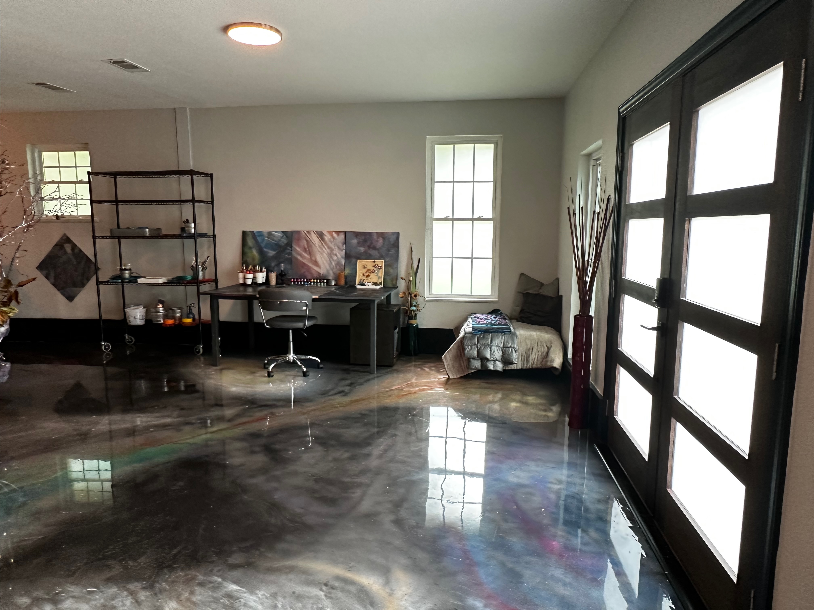

# The Habitat

***

### The first mark

<figure><figcaption>
Artwork: Brittany and Evelyn Brooks
</figcaption></figure>

Two children painted on a wall in a room that was safe for painting on walls.

The large bug belongs to the older one. The small creature — part butterfly, part dragonfly, still deciding — belongs to the younger one. The handprints belong to both. No one told them what to paint. No one graded the result. The room was a studio, which meant: this surface is available, your imagination is welcome here, what you make matters.

That room was in a house we eventually had to leave. Before we left, we transformed it — galaxy epoxy floor with comets and a black hole, shed doors rebuilt from rotten wood and fiberglass and bondo into a chartreuse-to-teal gradient, every surface given the attention it deserved — because we understood it had been a healing space and we wanted to leave that quality in it for whoever came next. We were not done with our grief about leaving. We made something beautiful anyway.

The wall painting stayed until the wall was removed for an enlarged doorway. It was an important mark. It was a reason that everything emerging is possible.

<figure><figcaption></figcaption></figure>

***

### What habitat design actually is

I have spent my adult life making habitats.

Not galleries. Not studios in the conventional sense. Habitats — environments designed to hold space for imagination, beauty, and healing simultaneously, for whoever inhabits them.

A gymnastics facility in Michigan where the walls became an underwater world, fish swimming above a ball pit, a crocodile holding a small bird in its open mouth beside the words a child wrote: _if you don't take care of your oceans, the fishys won't have anywhere to take a bath / i have never met a whale._ I painted those walls as a young mother, before I understood what I was healing from, because my nervous system knew what it needed before my mind did.

A house in Texas where a painted door became chartreuse because grief needed somewhere to go that wasn't into anyone's body.

An apartment in Richardson where the artwork hangs at cat level, where the studio table is also the navigation space of a small creature named Sophia who moves through complexity the way the monarch butterfly moved through the branch tangle — entirely at home, no agenda, following what draws her.

Classrooms. Corridors. Living rooms. Sheds. The medium was always the environment.

The framework I am now developing — VIM, the Bridging Spiral, TKGPT — is this same practice expressed in a different medium. The instrument panel is a habitat for thinking. The MPCM boundary is a threshold that keeps the space safe. The kindness field is the structural condition that makes transformation possible rather than retraumatizing.

I did not arrive at these ideas through theory. I arrived at them through decades of making spaces where people — children especially — could be surprised by their own imagination.

***

### Three generations, one practice

_\[Image: Evelyn at the frosted glass door, silhouette, looking through]_

_\[Image: Evelyn and Leanne at the painted interior door, chartreuse, sunburst, birds]_

_\[Image: Karen and Evelyn at the front door of the house, leaving]_

A child learns what a door is by encountering many kinds of doors.

A plain door that opens to outside. A painted door that announces: _someone here cared enough to make this beautiful._ A frosted glass door that lets light through but not image — the outside visible as suggestion, as possibility, not yet determined.

These photographs were taken over several years, in the same house, at different thresholds. Evelyn is the same child in all of them, encountering different kinds of boundaries. She is curious in all of them. She is safe in all of them.

Her mother Brittany grew up in environments like this — spaces where creativity was the expected response to difficulty, where making something was understood as a form of agency, where the aesthetic quality of the surroundings was an act of respect toward the people living inside them.

Her aunt Leanne grew up the same way. The garment she made — thousands of recycled fragments arranged in precise spectral sequence, red through orange through yellow through green through blue through violet — is not a separate artwork. It is evidence of what a person becomes when they have spent a lifetime inside habitats that treated imagination as essential infrastructure.

_\[Image: MJ-generated garment image — the figure with the rainbow cape-train against black ground]_

The machine, given a description of Leanne's garment, produced this. It understood scale, spectral sequence, architectural drama, museum lighting. It produced something genuinely beautiful.

It did not know about the house in Texas. It did not know about the wall with the handprints. It did not know that the woman who made the original garment learned to make beautiful things in spaces designed to teach her that beautiful things were worth making.

The gap between what the machine produced and what the garment actually is — that gap is the location of meaning. It is also the reason habitat design matters. You cannot describe your way to the conditions that produce flourishing. You have to build them.

***

### The monarch and the garment

_\[Image: monarch butterfly in the branch tangle]_

_\[Image: MJ garment — the dissolving-edge variant, fragments dispersing into rainbow]_

Two creatures. Two complex environments. Both at rest in what they chose.

The butterfly navigated to the branch tangle without instruction. The woman who made the garment navigated to her medium — recycled material, spectral sequence, architectural scale — through decades of immersion in environments that held space for that kind of choice.

Neither outcome was planned. Both were prepared for.

This is what the framework calls the prosocial attractor: not a destination imposed from outside, but a basin that living systems move toward when the field conditions support it. Kindness is the field condition. The habitat is the kindness made physical.

***

### What the machine cannot design

The "describe" strategy — submitting an image to a generative AI system and asking it to produce a text description, then using that description to generate new images — reveals what the machine perceives and what it does not.

When I submitted a description of Leanne's garment to Midjourney, it produced images of extraordinary formal beauty. Spectral sequence rendered with precision. Scale conveyed. Dramatic lighting achieved.

What the prompt could not contain:

* The house in Michigan with the fish on the gymnasium walls
* The wall in Texas with the bug and the small creature and the handprints
* The chartreuse door rebuilt from rotten wood because grief needed somewhere to go
* The decades of making spaces where children were safe to be surprised by themselves
* The grandmother who understood — before she had language for it — that the environment is the curriculum

The machine produces beauty from description. It cannot produce the conditions that make beauty necessary.

That is not a deficiency in the machine. It is the location of human agency. It is why habitat design cannot be automated. It is why the framework always points beyond itself — toward the embodied life, the living space, the people in the room, the child at the threshold.

***

### The practice, continued

The apartment in Richardson is the current habitat.

_\[Image: Sophia on the studio table, moving across the working surface]_

_\[Image: Sophia at the arched mirror installation, butterflies and found objects]_

_\[Image: The living room — art stacked to the cathedral ceiling, painting in the fireplace instead of fire]_

Sophia is a wild creature who does not go outside — though a harness and leash have recently been acquired, because the doves are nesting in the eaves and the patio is a threshold worth learning to navigate safely. She moves through the apartment the way she moves through everything: entirely present, no agenda, following what draws her.

The artwork hangs at her level. The studio table is also her table. The arched mirror installation is also her installation — butterflies and found objects and reflected light, a habitat within the habitat.

When children and grandchildren visit, they come into this space. They go to the nature preserve. They walk paths where strangers become collaborators in something they don't have a name for. They return to a space where every surface says: _imagination was here. It is still here. It is available to you._

That is the practice. It does not end. It does not require a gallery or an institution or a platform. It requires sustained attention to the question: _what conditions allow living systems to flourish?_

And then it requires building those conditions, repeatedly, in whatever space is available, for however long you have it.

The wall with the handprints is gone now — painted over when we prepared to sell, or perhaps still there beneath the new owners' choices, a trace beneath the surface. The galaxy floor may still be there. The chartreuse doors are gone, replaced. The gymnastics facility has new walls.

None of that erases what happened in those spaces. The people who were inside them carry it forward. That is how habitat design propagates — not through the permanence of the physical space, but through the nervous systems of the people who were shaped inside it.

That is the only transmission that matters.

***

### Epistemic status

<table><thead><tr><th>Claim</th><th width="123.20703125">Tier</th><th>Note</th></tr></thead><tbody><tr><td>Environment shapes development — the medium is the curriculum</td><td>Tier 1</td><td>Established in developmental psychology, embodied cognition, and learning environment research</td></tr><tr><td>Habitat design as a coherent art practice</td><td>Tier 2</td><td>Theoretically coherent; not yet a named category in contemporary art discourse</td></tr><tr><td>Kindness as structural field condition enabling transformation</td><td>Tier 2</td><td>Consistent with trauma-informed design literature and attractor dynamics</td></tr><tr><td>The gap between machine description and embodied knowledge as the location of meaning</td><td>Tier 2</td><td>Methodologically coherent; see Traces page for full epistemological framing</td></tr><tr><td>Generational transmission through designed environments</td><td>Tier 2</td><td>Supported by attachment theory and family systems research; this account is also Tier 4 — researcher positionality</td></tr><tr><td>Love as the sufficient condition for beautiful work</td><td>Tier 3</td><td>Held open deliberately. The evidence is suggestive. The question remains generative.</td></tr></tbody></table>

***

_Next: Traces_ _Previous: The Designer's Oath_

***

_Humanity++ | CC BY-SA 4.0_ _Repository: https://kdoore.github.io/HumanityPlusPlus_ _GitBook: https://kdoore.gitbook.io/vital-intelligence_ _Draft: April 2026 — SR3 Section_
