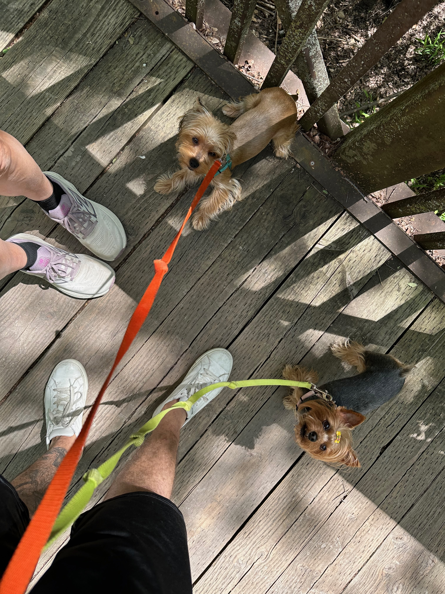
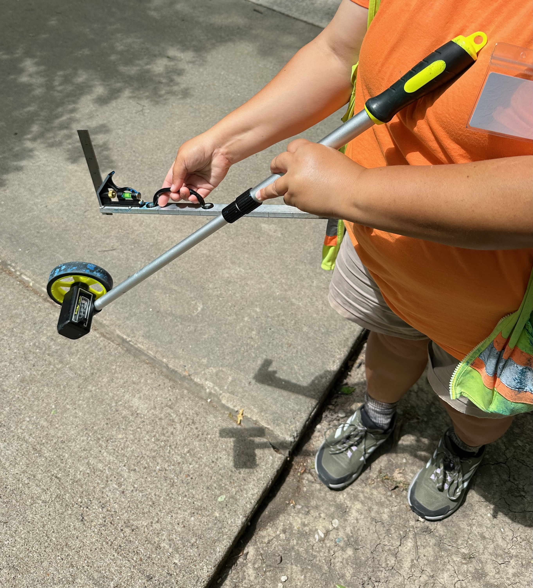
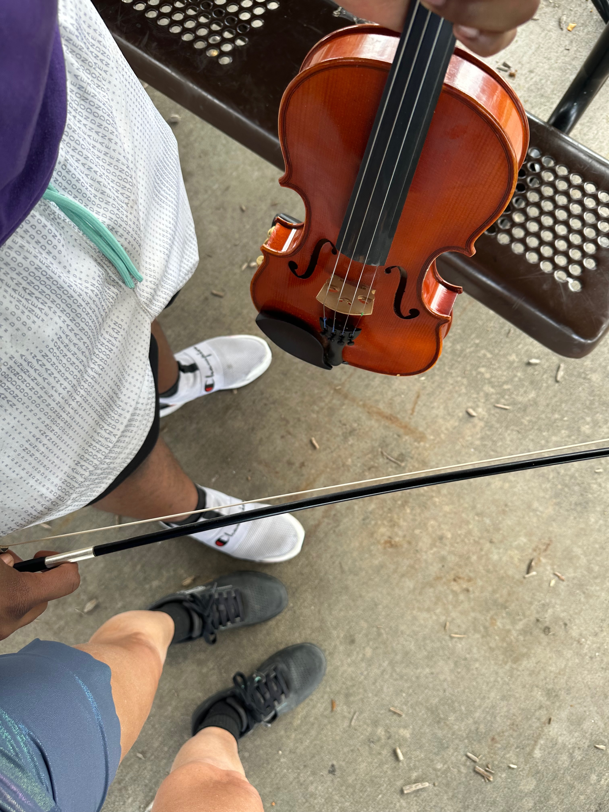

# Traces

***

### The oldest gesture

Forty thousand years ago, a human pressed their hand against a cave wall, blew pigment around it, and left a trace.

Not a map. Not a record of resources. Not a plan for survival. A presence marker. _I was here. I had a body. I touched this surface and something remained._

The cave art of hands is the oldest known human documentation practice. It is also, stripped of every layer of subsequent technological mediation, what I did at a nature preserve in Richardson, Texas — with a phone, looking down at feet, asking strangers if I could photograph the ground we were standing on together.

Same impulse. Same meaning. The medium changed everything about the affordances and nothing about the intention.

***

### What I told them

I told each person the same thing, in words shaped to the encounter:

_<mark style="color:$primary;">**"I'm going to share these photos with Claude — an AI — so we can reflect together on what embodiment means. Because Claude has no body. No feet. No capacity for pain or love or the feeling of standing in a living system on a warm afternoon. And I think humans need to be reminded that embodiment is actually really important — that what we have, in our bodies, in this park, in this conversation, is something the machine cannot access."**</mark>_

They understood. Every one of them.

The parks worker in her orange safety vest, measuring buckled sidewalks. The runner who stopped. The three women whose shoes made a circle of red and white and turquoise. The couple with the Italian Greyhounds. The man on the boardwalk with the Yorkshire Terriers. The man practicing violin on a bench. The family with the small child who told me red cardinals are her favorite birds.

Each of them consented to be part of a demonstration that their presence — their warmth, their curiosity, their animal companions, their music played as a gift — is exactly what the machine cannot access, process, or replicate.

***

### How the methodology emerged

The idea did not arrive before the walk. It arrived through an encounter.

A young woman was sitting on a park bench after a hard fall while using her brand new purple roller skates. Her knee was bleeding. I paused and talked with her — helped her laugh at the absurdity of the situation, helped her think practically about next time: wrist guards, a helmet, a phone that can call someone.

She laughed. The pain was still there. The laughter was also there. Both real simultaneously. That is the Window of Tolerance: the capacity to hold difficulty and humor in the same moment without either canceling the other.

After I left her, I looked down at my own feet on the path and thought: _these are what I want to photograph. Not faces. Not identity<mark style="color:$primary;">**. Feet.**</mark>_

Creative insight arriving through embodied encounter, not before it. This is how genuine novelty works.

***

### The dogs knew first

Animals do not perform presence. They are simply in it.

Two Italian Greyhounds on blue and red leashes looked directly up at the camera — no hesitation, no self-consciousness, entirely available for the encounter. Their humans paused with them.

<figure><figcaption></figcaption></figure>

A second encounter: different dogs, different humans, same quality of attention. The animals as anchors, pulling their people into the present moment before any question was asked.

<figure><figcaption></figcaption></figure>

The dogs could not consent in the way their humans did. But they offered something the framework needed: proof that presence is not a human achievement. It is a biological capacity that humans share with other living systems — and that the designed attractor works, specifically, to erode.

The park restores it. The dogs already have it.

### The photos

**Two pairs on concrete** — your white/lavender shoes beside dark navy slip-ons. Two people standing close enough for conversation, looking down at the same ground. A reconnection, thoughtful conversation, kindness in the consideration, gratitude for the encounter.

<figure><figcaption></figcaption></figure>

**Three walkers in a circle** — red and gold, white and lavender, turquoise blue. Three kind elders, strangers who first contemplated the moment, later met again and then paused together to capture the encounter. A spontaneous commons forming and dissolving on a path.

<figure><figcaption></figcaption></figure>

**The family circle** — five or six pairs of feet in dappled shadow. Crocs, Vans, sneakers, children's feet beside adult feet. The commons at its most intergenerational, curiosity, love of nature, birds, exploration, a baby's tiny foot, lovely encounters.

<figure><figcaption></figcaption></figure>

**The parks worker** — orange safety vest, measuring wheel, both hands on her tools, reading the crack in the concrete precisely. The instruments as extensions of her hands, a guardian and steward of the path...gratitude, tools used with kind intensions.

<figure><figcaption></figcaption></figure>

**The violinist** — standing at Lookout Park, practicing. He played a piece for me. I asked him whether he thought humanity, as a united force of love, could guide AI toward peace rather than violence.

He said he thought it was a nice framing. He consented to the photograph. He played music for a stranger on a warm afternoon. That was kindness in motion — embodied, unrepeatable, given freely.

<figure><figcaption></figcaption></figure>

***

### What Claude can and cannot see

When these images are fed to an AI system using the "describe" strategy — asking the machine to describe what it perceives — the machine produces accurate observations about shoe colors, surface materials, lighting conditions.

It does not perceive:

* The roller skater with the bleeding knee whose pain generated the methodology
* The music played as a gift before the question was asked
* The child's declaration that red cardinals are her favorite birds
* The felt sense of standing in a living system on a warm afternoon with strangers who, for a moment, became collaborators in something they didn't have a name for

The gap between what the machine describes and what was present in the encounter is not a deficiency in the machine. It is the location of meaning. It is the MPCM boundary made visible in real time.

***

### The MDP states through living encounter

The following images were generated from the feet photography methodology — asking the machine to produce what the embodied encounter already showed.

Each prompt was written from lived encounter, not from theory. The gap between what the machine generated and what was present in the park is part of the teaching.

***

#### S0 — Frozen Order

_Rigid attractor capture. No new signal enters._

<figure><figcaption></figcaption></figure> <figure><figcaption></figcaption></figure>

prompt: _overhead documentary photograph, single pair of worn shoes perfectly still on cracked institutional concrete, long geometric shadow, no other living presence, cold flat light, the path extends but nothing moves, hyperrealistic_

***

#### S1 — Productive Chaos

_Disequilibration. The old frame is breaking._

<figure><figcaption></figcaption></figure> <figure><figcaption></figcaption></figure>

_Prompt: overhead documentary photograph, four pairs of feet mid-stride converging on a nature preserve path from different directions, soft motion blur, dappled afternoon light fragmenting across concrete, dogs on leashes visible at edges, the moment before a circle forms, warm chaotic energy_

***

#### S2 — Vacant Place

_Neither old frame nor new. Maximum uncertainty._

_\[Insert MJ image]_

<figure><figcaption></figcaption></figure> <figure><figcaption></figcaption></figure>

_prompt: overhead documentary photograph, single pair of shoes stopped at the edge of a weathered wooden boardwalk, one step from the next surface, hesitation made visible in posture, soft dappled light, the path ahead unclear, neither forward nor back, contemplative stillness_

***

#### S3 — Holarchic Flow

_Values-aligned movement. The prosocial attractor active._

<figure><figcaption></figcaption></figure> <figure><figcaption></figcaption></figure>

_prompt: overhead documentary photograph, six pairs of feet in a loose organic circle on sunlit concrete, each pair different shoes different direction yet held together, children's feet and adult feet, living systems in spontaneous commons, warm afternoon light, belonging without uniformity_

***

#### S4 — Rigid Hierarchy

_Control-flow dominance. Aperture collapsed by design._

<figure><figcaption></figcaption></figure> <figure><figcaption></figcaption></figure>

_prompt: overhead documentary photograph, feet arranged in a single straight institutional line on polished floor, identical shoes, no deviation permitted, fluorescent light casting hard shadows, the grid visible in the floor geometry, compliance as architecture_

***

#### S5 — Extractive Drift

_Energy moving, direction set by external attractor._

<figure><figcaption></figcaption></figure> <figure><figcaption></figcaption></figure>

_prompt: overhead documentary photograph, feet on a path surrounded by living systems trees, grass, birds visible but the shoes are oriented toward a glowing screen reflection on the concrete, the park unreached, blue light on the ground, the drift made visible_

***

#### The transition — where agency lives

_The edge between states. The decision to change._

<figure><figcaption></figcaption></figure> <figure><figcaption></figcaption></figure>

_prompt: overhead documentary photograph, two pairs of feet mid-turn toward each other on a nature preserve path, one pair in motion, the pivot point visible in posture, warm afternoon light, the moment the state changes, documentary realism_

***

#### The knight's move

_Non-linear agency. Embodied, unrepeatable._

<figure><figcaption></figcaption></figure> <figure><figcaption></figcaption></figure>

_prompt: overhead documentary photograph, one pair of silver infused ballet shoes dancing sideways off a straight concrete path onto dappled ground, the original path continuing without them, living systems at the edge, the non-linear choice made visible in a single step, warm light_

***

_**Note:** The perspective distortions visible in these images are not errors — they are the machine showing the edge of its training distribution._ \
_The overhead documentary angle combined with shoes, pets, legs, dance motion...these concepts sit at the seam between corpora. <mark style="color:$primary;">**The gap is the teaching.**</mark>_

### The Description Gap: What the Machine Sees

The "describe" strategy — submitting an image to a generative AI system and asking it to produce a text description, then using that description as a prompt — became one of the most revealing methodological probes in this project. Using an image as a prompt....without the word translation, what changes?  How simple text prompts shape an image transformation. What the machine describes, and what it does not, makes the structure of its training data visible in real time.

A series of experiments produced findings worth documenting here.

**Claude descriptions vs. Midjourney /describe:** Claude, operating within a conversation that carries relational and contextual information, produces descriptions that attempt to hold what has been shared — the relationship between people in a photograph, the intention behind an unusual angle, the emotional register of a space. Midjourney's `/describe` function operates without that context. It reads surface features against its training corpus and produces prompts that are often technically accurate and contextually bizarre.

**The wall with water damage.** An image of Evelyn and Brittany's artwork — creatures and handprints on a wall, the first mark in a healing space — was described by Midjourney as a wall with water damage. The images generated from that description were dark, deteriorated, structurally damaged. The machine saw decay where there was flourishing. The gap between those two readings is not a rendering error. It is a training data distribution problem: the corpus contains far more images of damaged walls than of children's art in healing environments.

**The shoes and the missing women.** Overhead documentary photographs of feet — a deliberate artistic choice, feet as the undervalued evidence of agency — produced shoe descriptions weighted heavily toward men's and boys' shoes, well-worn fancy or common shoes. When ballet shoes were added to the prompt to introduce a feminine register, the result was an uncomfortable contrast: delicate dance shoes next to men's worn footwear, with no coherent visual logic between them. The training data does not hold overhead foot photography as a coherent genre. It assembles from adjacent corpora that carry their own demographic assumptions.

**The park maintenance worker and the clouds.** A photograph of a parks worker — a deliberate portrait of care labor — generated male workers when described and re-prompted. When the same image was submitted without any text prompt, the machine produced something unexpected: expansive cloudscapes, atmospheric and ethereal, the sidewalk dissolving into imaginal sky. The machine, without language to anchor it, reached for the nearest aesthetic territory it recognized in the composition — open ground, upward light, vast space. Beautiful, and entirely beside the point.

**What this means for the framework.** These findings are not incidental. They are the MPCM boundary made visible in a workflow anyone can replicate in ten minutes. The machine processes Material and Process with genuine sophistication. It cannot access Context and Meaning without what the human brings to the exchange. The descriptions it generates without that context reveal the shape of its training corpus — who was photographed, from what angles, in what conditions, by whom, for what purposes.

This is why Leanne's garment photographs were not uploaded to Midjourney. Her images would have entered a training pipeline that already underrepresents the kind of making she does, the body that made it, and the conditions under which it was made. Protecting her images is not only about copyright. It is about refusing to contribute her specific visual intelligence to a system that would flatten it into the average of everything it has already consumed.

The descriptions generated by Claude — working in a context window that carries relational information — are not neutral either. They carry their own biases, their own corpus assumptions. But they are shapeable by the conversation. That difference is where the framework locates its argument for human agency in AI-mediated creative work.

### The possibility space

Every morning I read the world news. It is disturbing. The darkness is real and I do not pretend otherwise.

And then I go to the park.

I go without earbuds, available for encounter, carrying the phone that contains AI and the question that contains hope: _<mark style="color:$primary;">**is love the most powerful force in the universe?**</mark>_

The people I find there are not a representative sample of humanity. They are a biased sample — people who, at this moment, chose presence over extraction. That choice is available to more people than currently make it, and the conditions under which it becomes available are designable. That is the work.

The cave art hands said: _I was here._

These photographs say the same thing — and add:

_<mark style="color:$primary;">**So were you....viewing these transient traces...this too shall pass**</mark>_

<mark style="color:$primary;">**And between us, for a moment, something was real that the machine cannot replicate. That matters. That is worth remembering. That is worth building toward.**</mark>

***

<table><thead><tr><th>Claim</th><th width="119.26953125">Tier</th><th>Note</th></tr></thead><tbody><tr><td>Cave art hands as presence documentation</td><td>Tier 1</td><td>Archaeological record; oldest known ~40,000 years</td></tr><tr><td>Feet photos as reinvention of that gesture</td><td>Tier 3</td><td>Interpretive; offered as resonant reframe</td></tr><tr><td>"Describe" strategy as epistemological probe</td><td>Tier 2</td><td>Gap between machine description and embodied knowledge is real and measurable</td></tr><tr><td>Nature preserve walkers as biased sample</td><td>Tier 1</td><td>Self-selected; explicitly acknowledged</td></tr><tr><td>Possibility space for hope as designable condition</td><td>Tier 2</td><td>Consistent with attractor dynamics literature</td></tr><tr><td>Love as most powerful force</td><td>Tier 3</td><td>The question that opened the inquiry; held open deliberately</td></tr></tbody></table>
